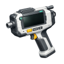

  

|Item|`OreScannerTool`|
|---|---|
|**Module**|`ARCHEAN_celestial`|

# Description
Das Ore Scanner Tool ist ein Handgerät, das die Mineralzusammensetzung in der Richtung anzeigt, in die du schaust. Es zeigt ein Echtzeit-Diagramm der Erzdichte im Verhältnis zur Entfernung und ermöglicht es dir, Erzvorkommen vor dem Abbau zu lokalisieren.

Dieses Werkzeug unterscheidet sich von der [OreScanner-Komponente](../components/mining/OreScanner.md) — während die Komponente für die Montage an Fahrzeugen und Steuerung über XenonCode gedacht ist, bietet das Ore Scanner Tool eine sofortige visuelle Oberfläche für den Spieler.

# Usage

## Grundbedienung
1. Rüste das Ore Scanner Tool aus deinem Inventar aus
2. Zeige in die Richtung, in der du scannen möchtest
3. Das Werkzeug zeigt ein Diagramm mit den Erzkonzentrationen entlang dieser Richtung an

## Oberfläche
Das Scanner-Fenster zeigt:
- **Entfernungswähler**: Wähle den Scanbereich (100 m, 250 m, 500 m oder 1000 m)
- **Erz-Checkboxen**: Wähle, welche Erze im Diagramm angezeigt werden sollen
- **Diagramm**: Zeigt die Erzdichte (Y-Achse) im Verhältnis zur Entfernung (X-Achse)

## Erztypen
Der Scanner kann folgende Erze erkennen:

|Symbol|Element|Farbe|
|---|---|---|
|Al|Aluminium|Silber/Hellgrau|
|C|Carbon|Schwarz|
|Cr|Chrome|Grau Metallisch|
|Cu|Copper|Orange|
|Au|Gold|Goldgelb|
|F|Fluorite|Lila|
|Fe|Iron|Rostbraun|
|Pb|Lead|Dunkelgrau|
|Ni|Nickel|Grünlich Grau|
|Si|Silicon|Dunkelblau|
|Ag|Silver|Hellsilber|
|Sn|Tin|Gräulich|
|Ti|Titanium|Bläulich|
|W|Tungsten|Dunkelgrau|
|U|Uranium|Grün|

## Scan-Tipps
- Die Scanrichtung basiert auf der horizontalen Komponente deiner Blickrichtung
- Das Diagramm aktualisiert sich automatisch, wenn du dich bewegst oder die Richtung änderst
- Wähle mehrere Erze aus, um ihre Standorte zu vergleichen
- Iron (Fe) ist standardmäßig ausgewählt, da es die häufigste Ressource ist

---

> **Hinweis:** Das Ore Scanner Tool erfordert den Aufenthalt auf einem Himmelskörper mit Terraindaten. Es funktioniert nicht im Weltraum oder in Umgebungen ohne Terrain-Zusammensetzungsdaten.
