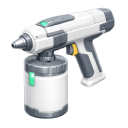

    

|Item|`PaintTool`|
|---|---|
|**Module**|`ARCHEAN_build`|

# Description
Das Paint Tool ermöglicht es dir, Blöcke, Kabel, Labels und Komponenten mit benutzerdefinierten Farben und Oberflächeneffekten zu bemalen.

# Usage

## Steuerung
| Aktion | Steuerung |
|--------|---------|
| Fläche bemalen | **Linksklick** |
| Ganzen Block bemalen (alle Flächen) | **Shift** + **Linksklick** |
| Farbe vom Block aufnehmen | **Rechtsklick** |
| Farbe im gesamten Bauwerk ersetzen | **X** + **Linksklick** |

## Farbpaletten
Das Paint Tool verwendet ein Palettensystem zum Speichern und Organisieren deiner Farben.

### Palettenverwaltung
- **Create**: Eine neue leere Palette erstellen
- **Copy**: Die aktuelle Palette mit einem neuen Namen duplizieren
- **Delete**: Die aktuelle Palette entfernen

### Farben hinzufügen
Klicke auf die **+**-Schaltfläche in der Palette, um einen neuen Farbplatz hinzuzufügen.

## Farbwähler
Der untere Bereich der Oberfläche enthält:

1. **RGB-Farbwähler**: Wähle eine beliebige Farbe mit dem Farbtonbalken und dem Sättigungs-/Helligkeitsquadrat
2. **Gamma-Vorschau**: Zeigt, wie die Farbe im Spiel mit deinen Gamma-Einstellungen erscheinen wird

## Oberflächenmaterialien
Jede Farbe kann eine andere Oberflächenbeschaffenheit haben:

| Material | Aussehen |
|----------|------------|
| **Matte** | Raue, nicht-reflektierende Oberfläche |
| **Glossy** | Glatte, glänzende Oberfläche |
| **Metal** | Raue metallische Oberfläche |
| **Chrome** | Spiegelgleiche metallische Oberfläche |
| **Transparent** | Durchsichtig (für Glaseffekte) |

## Farbe ersetzen
Halte **X** und **Linksklick** auf eine beliebige bemalte Oberfläche, um diese Farbe im gesamten Bauwerk zu ersetzen. Dies funktioniert bei:
- **Blöcken**: Ersetzt alle Blöcke mit demselben Farbindex
- **Rohren/Kabeln**: Ersetzt alle Rohre mit derselben Farbe
- **Komponenten**: Ersetzt alle Komponenten desselben Typs und Materials

## Symmetrie-Bemalen
Wenn das Bauwerk den [Symmetriemodus](ConstructorTool.md) aktiviert hat, bemalt das Paint Tool automatisch auch den gespiegelten Block. Dies gilt für:
- Einzelflächenbemalung
- Ganzblockbemalung (**Shift**)

Wenn der Block auf der Symmetrieebene liegt, wird stattdessen die gespiegelte Fläche desselben Blocks bemalt.

> **Hinweis**: Farbe ersetzen (**X**) betrifft immer das gesamte Bauwerk unabhängig von der Symmetrie, daher wird die Symmetrie in diesem Modus nicht angewendet.

# Hinweise
- Das Bemalen eines Blocks wendet die Farbe **pro Fläche** an (verwende Shift für alle Flächen)
- Kabel haben zusätzliche Anpassungsoptionen, siehe [Spool](../consumables/Spool.md#painting-cables)
