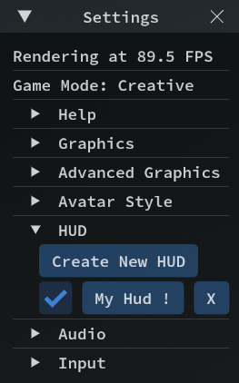

# HUD-Verwaltung in Archean
## Einleitung
Das HUD-System (Heads-Up Display) ermöglicht es Spielern, eigene grafische Oberflächen zu erstellen, um Informationen auf dem Bildschirm anzuzeigen, wie Texte, Schaltflächen, Zeichnungen... unter Verwendung von XenonCode.

HUDs werden vollständig vom Client verwaltet, was bedeutet, dass jeder Spieler seine eigenen HUDs hat und andere Spieler sie nicht sehen können. Sie können jedoch über ein integriertes System, das das Senden und Empfangen von Daten auf Frequenzen ermöglicht, mit [Beacon](../components/navigation/Beacon.md) oder anderen Spielern kommunizieren.

Es ist wichtig zu beachten, dass HUDs, da sie vollständig clientseitig sind, auf allen Servern/Welten verfügbar sein werden, mit denen du dich verbindest. Du kannst sie nicht für einen bestimmten Server/eine bestimmte Welt festlegen, außer manuell, wie im nächsten Abschnitt angegeben.

> Zusätzliche Informationen:
> - Bei der Verwendung einer Schaltfläche oder einer anderen Interaktion auf einem HUD wird der `Rechtsklick` bevorzugt, um das Greifen der Mausblicksteuerung zu vermeiden.

## Ein HUD erstellen
Da HUDs eine vollständig clientseitige Funktion sind, haben sie keine direkt zugehörigen Items im Spiel. Um ein HUD zu erstellen, musst du über das Spieleinstellungsmenü `F1` gehen und zum `HUD`-Tab navigieren.



Von diesem Menü aus kannst du beliebig viele HUDs erstellen und sie nach Belieben über die Checkbox aktivieren/deaktivieren. Es ist wichtig zu wissen, dass jedes HUD eine einzigartige Instanz ist und nicht nativ mit anderen HUDs kommuniziert, obwohl eine Kommunikation über eine Funktion möglich ist, die später auf dieser Seite erklärt wird.

Sobald dein HUD erstellt ist, kannst du seine IDE öffnen, um deine Funktionen zu programmieren.

## Deine erste grafische Oberfläche erstellen
HUDs verwenden Panels zur Anzeige von Inhalten auf dem Bildschirm. Ein Panel kann grafische Elemente wie Texte, Schaltflächen, Zeichnungen enthalten...

Du kannst beliebig viele Panels erstellen und sie nach Belieben auf dem Bildschirm positionieren.
Um ein Panel zu erstellen, ist die Syntax ähnlich wie bei einem [Dashboard](dashboard.md)-Bildschirm.
    
```xc
var $panel = panel(center, sizeX, sizeY)
```

Beispiel eines HUDs, das "Hello World" in der Bildschirmmitte in einem grauen Kasten von 100x50 Pixeln anzeigt

```xc
var $panel = panel(center, 100, 50)

init
    $panel.blank(gray)
    $panel.write(1, 1, cyan, "Hello World")
```


# Liste HUD-spezifischer Funktionen

### Funktionen bezüglich des Spielfensters
```xc
screen_w ; returns the width of the game window
screen_h ; returns the height of the game window
screen_ratio ; returns the aspect ratio of the screen (width/height)
fov ; returns the player's camera field of view (radians)
aim_distance ; returns the distance of whatever the player is aiming at in meters

mouse_x ; returns the x position of the mouse on the game window
mouse_y ; returns the y position of the mouse on the game window

set_resolution_scale($scale)
; Sets the internal resolution of the HUD, from 1 (full resolution) to 8 (lower resolution).
; Default is 2. The HUD is rendered at screen resolution divided by $scale.
; Final display size is affected by ($scale * ui_scaling).
```
> Es ist wichtig zu beachten, dass die in den Spieleinstellungen konfigurierte UI-Skalierung die von diesen Funktionen zurückgegebenen Werte beeinflusst. 

### Funktionen bezüglich Panels
```xc
var $myPanel = panel(center, $width, $height) ; creates a panel centered on the screen of size width, height
; 'Center' can be replaced by 'Top', 'top_left', 'top_right', 'bottom', 'bottom_left'...

$myPanel.set_position($x, $y) ; moves the panel to position x, y
$myPanel.set_size($width, $height) ; resizes the panel to size width, height

$myPanel.width ; returns the width of the panel
$myPanel.height ; returns the height of the panel
$myPanel.x ; returns the x position of the panel
$myPanel.y ; returns the y position of the panel
$myPanel.scroll ; returns the mouse scroll value (-1, 0, or 1)

; ENTRY POINT
click.$myPanel ($x:number, $y:number) ; returns the click position within the panel
```
Hinweis: Die Art, auf dem Panel zu zeichnen, ist ähnlich wie beim [Dashboard-Bildschirm](../xenoncode/dashboard.md#screen-rendering-functions)

### Funktionen bezüglich des integrierten Computers
```xc
set_cps(25) ; sets the number of HUD cycles per second
tick ; returns the current tick index
language ; returns the player's current language code (e.g., "en", "fr")
mouse_look() ; returns 1 if mouse look is active, 0 otherwise
```

### Funktionen bezüglich Kommunikation
```xc
var $beacon = beacon($transmitFreq, $receiveFreq) ; Allows sending/receiving data

var $data = $beacon.data ; returns the data received by the beacon
var $distance = $beacon.distance ; returns the distance between the player and the remote beacon
var $dir_x = $beacon.direction_x ; returns the x direction between the player and the remote beacon
var $dir_y = $beacon.direction_y ; returns the y direction between the player and the remote beacon
var $dir_z = $beacon.direction_z ; returns the z direction between the player and the remote beacon
var $is_recv = $beacon.is_receiving ; whether this beacon is receiving data on the receiving frequency

$beacon.transmit($data) ; sends data on the transmission frequency
```

# Gemeinsame Werte
Gemeinsame Werte sind eine Funktion, die das Abrufen und Setzen von Informationen im Client des Spielers ermöglicht.

Eine Liste gemeinsamer Werte ist nativ verfügbar, um dir das Abrufen von Informationen über die Umgebung des Spielers zu ermöglichen.

```xc
var $comp = get("avatar_sensor_environment_composition") ; returns the composition of the player's environment
var $density = get("avatar_sensor_density") ; returns the density of the player's environment
var $temp = get("avatar_sensor_temperature") ; returns the temperature of the player's environment in Kelvin
var $gravity = get("avatar_sensor_gravity") ; returns the gravity of the player's environment
var $speed = get("avatar_sensor_speed") ; returns the player's speed in m/s
var $alt = get("avatar_sensor_altitude") ; returns the player's altitude in meters
var $alt = get("avatar_sensor_altitude_absolute") ; returns the player's absolute altitude in meters
var $view = get("avatar_is_3rd_person") ; returns whether the player is in third person view

var $inv = get("avatar_inventory") ; returns the player's inventory as a string of key values
var $belt = get("avatar_belt") ; returns the content of the belt as a string of key values
var $mass = get("avatar_mass") ; returns the mass of the avatar including inventory in kg (Avatar base mass is 100kg)
var $water = get("avatar_water_level") ; returns the player's water level
var $o2 = get("avatar_oxygen_level") ; returns the player's oxygen level
var $h2 = get("avatar_hydrogen_level") ; returns the player's hydrogen level
```

## Eigene gemeinsame Werte erstellen
Es ist möglich, eigene gemeinsame Werte zu erstellen, um zum Beispiel Informationen zwischen HUDs zu übertragen/empfangen.
```xc
set("mySharedValue", "Hello World") ; sets a shared value identified by "mySharedValue" with the value "Hello World"
get("mySharedValue") ; returns the value of the shared value "mySharedValue"
```

# Virtueller Bildschirm und Screencopy
Diese Funktionen sind in HUDs verfügbar und funktionieren genauso wie auf Computern.
Siehe die Dokumentation für den [virtualscreen](../xenoncode/computer.md#virtual-screen-function) und [screen_copy](../xenoncode/computer.md#screen-rendering-functions-draw-on-a-virtual-screen).

# Beispiele
### HUD, das die Geschwindigkeit des Spielers anzeigt
```xc
var $panel = panel(top,100,12)

tick
	$panel.blank()
	$panel.text_align(top)
	$panel.write(1,1,cyan,text("Speed: {0} km/h", get("avatar_sensor_speed")*3.6))
```
<video controls width="600">
    <source src="hud-img/speedDemo.mp4" type="video/mp4">
</video>

### HUD, das ein Beacon anvisiert und die Entfernung anzeigt
```xc
var $panel = panel(center, 50,50)
var $beacon = beacon("", "target")

function @target_beacon($b:beacon, $p:panel, $width:number, $height:number, $color:number)
    if $b.direction_z > 0
        var $f = screen_w / (2 * tan(fov / 2))
        var $rz = $b.direction_z * (screen_w / screen_h)
        var $x_proj = ($b.direction_x * $f) / $rz
        var $y_proj = ($b.direction_y * $f) / $rz
        var $x = screen_w / 2 + $x_proj - $width / 2
        var $y = screen_h / 2 - $y_proj - $height / 2
        $p.set_position($x, $y)
        $p.set_size($width, $height)
        $p.blank()
        $p.draw_rect(0, 0, $width, $height, $color)
        $p.text_align(center)
        $p.write(text("{0.0} m", $b.distance))

tick
    @target_beacon($beacon, $panel, 50, 50, green)
```
<video controls width="600">
    <source src="hud-img/targetDemo.mp4" type="video/mp4">
</video>
