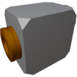

  

|Component|`HighVoltageRelay`|
|---|---|
|**Module**|`ARCHEAN_junction`|
|**Mass**|1 kg|
|[**Size**](# "Based on the component's occupancy in a fixed 25cm grid.")|25 x 25 x 25 cm|
#
---

# Description
The high voltage relay is a device that powers a component by allowing the current to flow only if a non-zero signal value is sent to its data port.

> The face with two ports is intended for connecting the power source and the data port.
>
> The energy output is located on the face with a single port.
