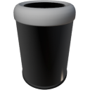

  

|Component|`TrashCan`|
|---|---|
|**Module**|`ARCHEAN_storage`|
|**Mass**|10 kg|
|[**Size**](# "Based on the component's occupancy in a fixed 25cm grid.")|50 x 50 x 100 cm|
|**Push/Pull Item**|Accept Push|
#
---

# Description
The TrashCan is a component that allows for instant destruction of the objects of the objets that were put in its inventory.

# Usage
`F` to open the TrashCan inventory. Once opened, you can deposit items to destroy them.

>- The TrashCan can be connected with an item conduit to automatically destroy items coming from an external source.
