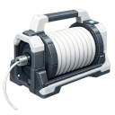

  

|Item|`SpoolTool`|
|---|---|
|**Module**|`ARCHEAN_build`|

# Description
The Spool Tool is used to place cables and pipes that connect components together, allowing the transfer of data, energy, items, or fluids between them.

# Spool Types
Press **C** to open the spool selection menu. There are 5 types of spools available:

  
  
  
  
  

|Type|Color|Usage|
|---|---|---|
|**Data Cable**|Blue|Connect data ports for information transfer|
|**Low Voltage Cable**|Red|Connect low voltage power ports|
|**High Voltage Cable**|Orange|Connect high voltage power ports|
|**Fluid Pipe**|Gray|Connect fluid ports for liquid/gas transfer|
|**Item Conduit**|Dark Gray|Connect item ports for item transfer|

Each spool type can only connect compatible ports. Spools can be stacked in your inventory and the remaining length is displayed on each spool item.

# Usage

## Selecting Spool Type
Press **C** to open the spool selection menu and choose the type of cable you want to place.

## Creating a Cable (Connecting Two Components)
1. Aim at a component's connector and **left-click** to start the cable
2. Click to add intermediate points to shape the cable path
3. Aim at the destination connector and **left-click** to complete the connection

During cable creation:
- **Right-click** removes the last placed point (or cancels if no points exist)
- **Scroll wheel** cycles through alternative auto-path-finding routes
- Hold **Shift** to snap cables to component surfaces
- Hold **X** to place the cable on the inner face of blocks/components

## Auto Path-Finding
The Spool Tool features automatic path-finding that suggests cable routes. Use the **scroll wheel** while placing to cycle through different route permutations.

## Creating a Flexible Cable
To connect components on different builds:
1. Start the cable on one build
2. End it on another build's component

This creates a **Flexible Cable** that:
- Links the two builds together physically
- Is constrained by the physics engine
- Has no force limit (won't detach)
- Is affected by gravity

You can also create a flexible cable between two components of the **same build** by holding **X**.

## Deleting a Cable
Hold **right-click** then quick press **left-click** on an existing cable to delete it.

## Painting Cables
Use the [Paint Tool](PaintTool.md) to customize cable appearance:
- Normal painting changes cable color
- Hold **Shift** for a striped effect
- Hold **X** to replace color on all matching cables
- Combine both for transparent stripes

---

> **Tips:**
> - If a cable refuses to be created, you may not have enough length remaining in your spool
> - Cables have no transfer limit or loss related to length
> - Cables do not determine transfer direction
> - A cable cannot be modified once placed - you must delete and recreate it
> - Flexible cables affect performance more than normal cables - prioritize normal cables when possible
> - Tools can use items from external containers by placing the tool inside that container
