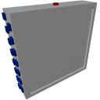
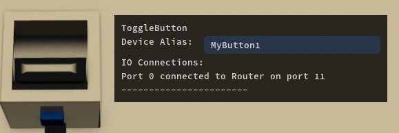

  

|Component|`Router`|
|---|---|
|**Module**|`ARCHEAN_computer`|
|**Mass**|20 kg|
|[**Size**](# "Based on the component's occupancy in a fixed 25cm grid.")|100 x 100 x 25 cm|
#
---

# Description
Un Router es un dispositivo utilizado para conectar diferentes componentes a una red. Su principal ventaja es la capacidad de conectar un número prácticamente ilimitado de componentes, todos controlables por uno o más Computer en la red. En cambio, la capacidad de un Computer individual para conectarse a componentes está limitada por su número de puertos disponibles.

Cada Router está equipado con 30 puertos de datos. Se pueden encadenar para aumentar el número total de puertos disponibles, multiplicando así los puertos por el número de Routers conectados entre sí.

Requiere una fuente de alimentación de bajo voltaje para funcionar y consume 50 vatios.

> - No es posible tener múltiples redes de Router separadas conectadas a diferentes puertos del mismo Computer. Un Computer solo puede interactuar con una red unificada de Router, pero esta red puede incluir un número ilimitado de Routers encadenados.

# Usage
Cuando el Router está encendido y conectado a componentes, permite asignar alias a los componentes a través de una interfaz visual tridimensional, que luego pueden usarse para identificar estos componentes desde el código del Computer.

Puedes abrir la interfaz del Router usando la tecla `F`.

La interfaz aparece como un entorno 3D (ver la imagen a continuación) en el que puedes navegar manteniendo presionado el `clic derecho del ratón`, usando las teclas de movimiento estándar `WASD`, `CONTROL/SPACE` para bajar/subir, y `Shift` para acelerar el movimiento.

Los componentes están posicionados en su posición 3D real relativa entre sí en la construcción, e incluirán todos los componentes conectados de todos los Routers en la cadena.

Cada componente muestra una etiqueta donde puedes ingresar el alias que se usará posteriormente en un Computer. Para aprender a usar los alias, consulta la página del XenonCode IDE.

Es posible asignar un alias a un componente directamente mostrando su ventana de información usando la tecla `V`, como se muestra en el ejemplo a continuación.

# Controlling multiple components with a single alias
En ciertas situaciones, puede ser práctico controlar múltiples componentes que sirven para el mismo propósito con un solo alias. Para hacerlo, simplemente agrega un asterisco `*` al final del alias en nodes/Xenoncode. Por ejemplo, si estás construyendo un avión y tienes cuatro alerones en el ala izquierda, puedes nombrarlos de la siguiente manera:
- `leftAileron1`
- `leftAileron2`
- `leftAileron3`
- `leftAileron4`

Luego puedes controlarlos usando el alias `leftAileron*`. El asterisco `*` te permite seleccionar todos los componentes cuyo alias comience con `leftAileron`.

# Additional information:
- Los Routers que se comunican directamente con un Computer deben estar alimentados, los demás Routers en la cadena no requieren energía. Esto también permite usar un [MiniRouter](MiniRouter.md) como si fuera un [Data Bridge](DataBridge.md) (sin energía) pero a diferencia del [DataBridge](DataBridge.md), este sí es capaz de resolver alias y referencias de pantalla.

- Para el enrutamiento de datos, un Router debe estar absolutamente conectado a un Computer u otro Router. No puedes tener este tipo de patrón `Computer > DataBridge/DataJunction > Router`.
