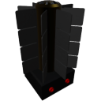

  

|Component|`RTG`|
|---|---|
|**Module**|`ARCHEAN_rtg`|
|**Mass**|50 kg|
|[**Size**](# "Based on the component's occupancy in a fixed 25cm grid.")|50 x 50 x 100 cm|
#
---

# Description
El generador termoeléctrico de radioisótopos (RTG) genera energía de bajo voltaje. Puede proporcionar una potencia continua dependiendo de la capacidad de enfriamiento del entorno.

# Usage
Conecta el RTG al componente que requiere energía de bajo voltaje para funcionar.

El RTG tiene dos puertos eléctricos, lo que te permite conectar dos componentes simultáneamente o encadenar múltiples RTGs para aumentar la potencia total de salida.

### List of outputs
|Channel|Function|
|---|---|
|0|Generated Power (Watts)|
|1|Output Power (Watts)|

> - El RTG puede generar hasta **12 kW** de potencia. Su salida real depende de la capacidad de enfriamiento del entorno (reducida a ~6 kW en el vacío del espacio). No tiene efectos nocivos sobre el jugador ni el entorno.
>
> - Si estás usando el RTG para alimentar dos componentes, la potencia total distribuida entre los dos puertos no puede exceder la potencia de salida disponible del RTG.
>
> - Si uno de los dos componentes quiere consumir toda la potencia disponible del RTG, puede impedir que el otro componente use energía en absoluto. Es mejor usar junctions de energía en este caso, para asegurar que todos los componentes reciban energía equitativamente.

# How to produce Plutonium

## Proceso de producción de plutonio

|Step|Inputs|Outputs|Temperature|
|---|---|---|---|
|Crusher|Uranium Ore: 1000 g|Uranium Powder (U) : 1000 g (U235 : 10%, U238 : 90%)|-|
|ChemicalFurnace (Yellow Cake - U₃O₈)|Uranium Powder (U) : 0.714 g, O₂ : 0.128 g|Yellow Cake (U₃O₈) : 0.842 g|750K - 950K|
|ChemicalFurnace (Uranium Dioxide - UO₂)|Yellow Cake (U₃O₈) : 0.842 g, H₂ : 0.004 g|Uranium Dioxide (UO₂) : 0.810 g, H₂O : 0.036 g|850K - 1050K|
|Crafter|Uranium Dioxide (UO₂) : 1000 g|Uranium Rod (U235 : 10%, U238 : 90%) : 1|-|
|Crusher|Uranium Rod|Plutonium Dioxide (PuO₂) : 1 g (Pu : 100%)|-|
|Crafter|Plutonium Dioxide (PuO₂) : 5000 g|Plutonium Pellet : 1|-|

> Se recomienda usar uranio de bajo enriquecimiento (LEU) para la producción de plutonio. El nivel de enriquecimiento no afecta la cantidad de plutonio obtenido.

---

# Additional Information

En la realidad, procesar plutonio a partir de combustible nuclear gastado es una operación industrial extremadamente compleja y exigente, que requiere infraestructura avanzada e instalaciones especializadas. Por esta razón, la recuperación y reprocesamiento de plutonio no están actualmente soportados en Archean.

En su lugar, los RTGs usan una forma simplificada de plutonio producida específicamente para la generación de energía. Aunque esta alternativa sigue siendo más fácil de manejar que el plutonio del mundo real, su producción es intencionalmente más difícil que en versiones anteriores del juego, haciendo que los RTGs sean menos triviales de obtener pero aún accesibles para jugadores avanzados.

