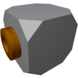

  

|Component|`PowerConverter`|
|---|---|
|**Module**|`ARCHEAN_junction`|
|**Mass**|5 kg|
|[**Size**](# "Based on the component's occupancy in a fixed 25cm grid.")|25 x 25 x 25 cm|
#
---

# Description

El Power Converter es un dispositivo que convierte energía de alto voltaje a bajo voltaje y viceversa.

Este dispositivo es útil, por ejemplo, para alimentar un Computer desde una High Voltage Battery si hay puertos disponibles y para evitar añadir una Low Voltage Battery. Sin embargo, si deseas alimentar un componente de alto voltaje desde una Low Voltage Battery, naturalmente seguirás limitado en términos de potencia total de salida basándote en la salida de la Low Voltage Battery.
