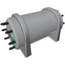

  

|Component|`Electrolyser`|
|---|---|
|**Module**|`ARCHEAN_chemical`|
|**Mass**|500 kg|
|[**Size**](# "Based on the component's occupancy in a fixed 25cm grid.")|100 x 100 x 200 cm|
|**Push/Pull Fluid**|Initiate Push/Pull|
#
---

# Description
El Electrolyser es un componente que permite la disociación del agua en hidrógeno y oxígeno.

# Usage
El Electrolyser requiere una entrada de energía de alto voltaje y hasta 10 kW durante su funcionamiento, y producirá de forma linealmente proporcional según la cantidad de energía disponible, hasta un máximo de 1 kg de agua por segundo con 10 kW de potencia.

Para iniciar el proceso de electrólisis, simplemente conecta una fuente de agua a su puerto de entrada azul. Esta fuente puede provenir de un [Fluid Port](../fluids/FluidPort.md) sumergido en agua para extraer agua directamente del mar, por ejemplo, o de un tanque que contenga agua.

El hidrógeno y el oxígeno producidos pueden recogerse respectivamente desde los puertos de salida amarillo (H2) y cian (O2).

### Producción
El Electrolyser puede procesar hasta 1 kg de agua por segundo, proporcionando aproximadamente [0,9 kg de oxígeno y 0,1 kg de hidrógeno](# "O2:0.88kg / H2:0.11kg") por segundo.