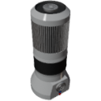

  

|Component|GeothermalExchanger|
|---|---|
|**Module**|`ARCHEAN_celestial`|
|**Mass**|200 kg|
|[**Size**](# "Based on the component's occupancy in a fixed 25cm grid.")|100 x 100 x 200 cm|
|**Push/Pull Fluid**|Initiate Push/Pull|
#
---

# Description
El Geothermal Exchanger es un componente diseñado para aprovechar el calor natural del subsuelo profundo para calentar un fluido.

# Usage
El Geothermal Exchanger está pensado para usarse exclusivamente en construcciones estacionarias. Una vez colocado en una construcción y alimentado con bajo voltaje (consumiendo 1000 vatios continuamente), se anclará automáticamente al suelo e impedirá completamente el movimiento de la estructura.

> #### Advertencia:
> - El Geothermal Exchanger bloquea la construcción en su lugar. Para restaurar la movilidad, primero debe ser destruido.
> - Si la estructura permanece estática después de destruir el Geothermal Exchanger, simplemente coloca un [Ground Anchor](../miscellaneous/GroundAnchor.md) temporalmente para actualizar su estado y permitir que vuelva a estar activa.

El Geothermal Exchanger debe colocarse muy cerca del suelo. Si su base está a más de 0,5 metros sobre el suelo, permanecerá inactivo.

Una vez operativo:
- Perfora lentamente hasta una profundidad máxima de 1000 metros.
- Cuanto más profundo llega, más caliente se vuelve el fluido circulante (hasta un máximo de 650K).
- Comienza a bombear el fluido una vez que alcanza los 373K.

Se utiliza principalmente para producir energía haciendo circular el fluido a través de una Steam Turbine.

### Información adicional
- El Geothermal Exchanger funciona exclusivamente con agua (H₂O).
- Caudal máximo: 0,1 kg/s.

> Una Small Steam Turbine generalmente puede ser abastecida eficazmente por hasta 10 Geothermal Exchangers, permitiendo una potencia máxima teórica de salida de aproximadamente 270 kW.

### List of Outputs
|Channel|Function|Value|
|---|---|---|
|0|Depth|meters|
|1|Temperature|Kelvin|