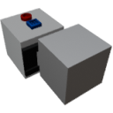

  

|Component|`LinearTrack`|
|---|---|
|**Module**|`ARCHEAN_build`|
|**Mass**|10 kg|
|[**Size**](# "Based on the component's occupancy in a fixed 25cm grid.")|25 x 25 x 50 cm|
#
---

# Description
El Linear Track es un componente que incluye un bloque móvil construible. Está diseñado para permitir la traslación lineal de objetos en una construcción. Solo puede desplazarse a lo largo de un riel creado automáticamente en el eje de movimiento del bloque.

>  *Este componente está relacionado con la presurización de construcciones, consulta la página de [Pressurization](../../pressurization.md) para más información.*

# Usage
El Linear Track puede funcionar en dos modos: Servo (por defecto) y Velocity. Para cambiar entre modos, pulsa la tecla V para abrir la interfaz de información del componente.

En esta interfaz, hay configuraciones adicionales posibles:
- `Max Speed` que determina la velocidad máxima en metros por segundo.
- `Acceleration` que determina la tasa a la que el Linear Track acelerará para alcanzar su Max Speed.
- `Override limits` cuando está activado, permite establecer manualmente los límites de posición mínima y máxima en lugar de usar los valores calculados automáticamente según el espacio disponible en el riel.

## Rieles
Los rieles del componente Linear Track se crean y actualizan automáticamente a lo largo de su eje. Se crean sobre bloques normales de cualquier tipo. Para terminar el riel, la línea debe interrumpirse. Por ejemplo, con otro bloque encima o dejando un hueco a lo largo del riel.

## Servo Mode
En modo servo, el dispositivo se mueve a una posición precisa determinada por los datos recibidos a través de su puerto de datos. Acepta todos los valores y reaccionará en consecuencia dentro del rango entre mín y máx. Si se recibe un número mayor o menor, se moverá a la posición mín/máx correspondiente.

## Velocity Mode
En modo velocidad, el dispositivo opera continuamente en la dirección indicada por los datos de su puerto, aceptando valores entre `-1.0` y `+1.0` para determinar su velocidad y dirección de movimiento. `1.0` significa Max Speed.

> - Las construcciones instaladas en una parte móvil no pueden colisionar con una construcción padre o hermana. Solo pueden colisionar con el terreno u otras construcciones separadas.
> - Para destruir el Linear Track, debes eliminar absolutamente todos los bloques/componentes hijos que contiene.
> - El Linear Track tiene un rango máximo de desplazamiento de -250m a +250m (500m en total).

### List of outputs
|Channel|Function|Value|
|---|---|---|
|0|Position|meters|
|1|Speed|m/s|
|2|Minimum Position|meters|
|3|Maximum Position|meters|

