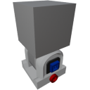

  

|Component|`SmallHinge`|
|---|---|
|**Module**|`ARCHEAN_build`|
|**Mass**|10 kg|
|[**Size**](# "Based on the component's occupancy in a fixed 25cm grid.")|25 x 25 x 50 cm|
#
---

# Description
El Small Hinge es un componente que incluye un bloque construible sobre una bisagra.

>  *Este componente está relacionado con la presurización de construcciones, consulta la página de [Pressurization](../../pressurization.md) para más información.*

# Usage
El Small Hinge solo funciona en modo servo.

Al usar V para abrir la interfaz de información, hay dos configuraciones posibles:
- `Max Rotation Speed` que determina la velocidad máxima de rotación en rotaciones por segundo.
- `Acceleration` que determina la tasa (en rotaciones por segundo al cuadrado) a la que la bisagra acelerará para alcanzar su Max Rotation Speed antes de desacelerar para alcanzar su posición objetivo.

El dispositivo rota a una posición precisa determinada por los datos recibidos a través de su puerto de datos. Acepta valores normalizados entre `-1.0` y `+1.0`, que corresponden a rotaciones de `-90°` y `+90°`, respectivamente.

> - Las construcciones instaladas en una parte móvil no pueden colisionar con una construcción padre o hermana. Solo pueden colisionar con el terreno u otras construcciones separadas.
> - Para destruir el Small Hinge, debes eliminar absolutamente todos los bloques/componentes hijos que contiene.
### List of outputs
|Channel|Function|Value|
|---|---|---|
|0|Angle|-1.0 to +1.0|
|1|Speed|rot/s|

