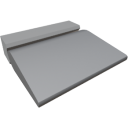

  

|Component|`Aileron`|
|---|---|
|**Module**|`ARCHEAN_aileron`|
|**Mass**|10 kg|
|[**Size**](# "Based on the component's occupancy in a fixed 25cm grid.")|25 x 25 x 100 cm|
#
---

# Description
El Aileron es un dispositivo que influye en la aerodinámica de una construcción.

Su eficacia está estrechamente relacionada con la densidad del medio en el que opera, ya sea en la atmósfera (aeronaves...) o en el agua (barcos...).

# Usage
El Aileron no requiere energía para funcionar, solo un valor entre `-1.0` y `+1.0` a través de su puerto de datos.

>- Los Ailerons no calculan oclusiones como lo hacen los bloques. Esto permite optimizar la eficiencia de vuelo de un vehículo ocultándolos en superficies más grandes, como dentro de las alas.
