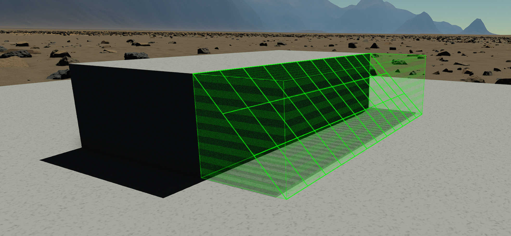

  

|Component|`Step`|
|---|---|
|**Module**|`ARCHEAN_misc`|
|**Mass**|1 kg|
|[**Size**](# "Based on the component's occupancy in a fixed 25cm grid.")|25 x 100 x 100 cm|
#
---

# Description
El Step es un componente que aparece como una placa, permitiendo la creación de escaleras.

# Usage
El Step puede colocarse sobre bloques y permite subir o bajar de un bloque a otro utilizando su collider, que tiene forma triangular (ver la figura a continuación).

Este sistema permite escaleras totalmente personalizables.

