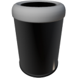

  

|Component|`TrashCan`|
|---|---|
|**Module**|`ARCHEAN_storage`|
|**Mass**|10 kg|
|[**Size**](# "Based on the component's occupancy in a fixed 25cm grid.")|50 x 50 x 100 cm|
|**Push/Pull Item**|Accept Push|
#
---

# Description
El TrashCan es un componente que permite la destrucción instantánea de los objetos que se colocan en su inventario.

# Usage
`F` para abrir el inventario del TrashCan. Una vez abierto, puedes depositar objetos para destruirlos.

>- El TrashCan puede conectarse con un conducto de objetos para destruir automáticamente objetos provenientes de una fuente externa.
