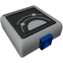

  

|Component|`MiniNavInstrument`|
|---|---|
|**Module**|`ARCHEAN_celestial`|
|**Mass**|1 kg|
|[**Size**](# "Based on the component's occupancy in a fixed 25cm grid.")|25 x 25 x 25 cm|
#
---

# Description
El MiniNavInstrument es una versión compacta del [NavInstrument](NavInstrument.md). Proporciona la misma funcionalidad de navegación en un formato más pequeño, ideal para paneles de control, vehículos pequeños o cuando el espacio es limitado.

A diferencia del NavInstrument de tamaño completo, el MiniNavInstrument no tiene un modo "OFF" - por defecto está en modo Flight cuando no se especifica ningún modo.

# Usage
El MiniNavInstrument requiere energía de bajo voltaje (200 W).
Ofrece los mismos tres modos de funcionamiento que el NavInstrument:
- **Flight**: Navegación en el entorno de un cuerpo celeste
- **Orbit**: Navegación en órbita
- **Locator**: Localizar un objeto o cuerpo celeste

Para cambiar entre modos, envía un valor de modo en el canal 6 a través del puerto de datos.

### List of inputs
|Channel|Function|Value|
|---|---|---|
|0|Locate Celestial|text|
|1|Locate Distance|number|
|2|Locate Direction X|number|
|3|Locate Direction Y|number|
|4|Locate Direction Z|number|
|5|Forward vector config|0 = forward, +1 = up, -1 = down|
|6|Set mode|1 = Flight, 2 = Orbit, 3 = Locator|

### List of outputs
|Channel|Function|Value|
|---|---|---|
|0|Forward Airspeed (m/s)|number|
|1|Vertical Speed (m/s)|number|
|2|Altitude (meters from sea level)|number|
|3|Above terrain (meters)|number|
|4|Horizon Pitch|-1.0 to +1.0|
|5|Horizon Roll|-1.0 to +1.0|
|6|Heading|0.0 to 360|
|7|Course|0.0 to 360|
|8|Latitude (degrees from -90 to +90)|-90 to +90|
|9|Longitude|-180 to +180|
|10|Ground Speed (m/s)|number|
|11|Ground Speed forward (m/s)|number|
|12|Ground Speed right (m/s)|number|
|13|Celestial|text|
|14|Celestial inner radius|number|
|15|Celestial outer radius|number|
|16|Orbital Speed (m/s)|number|
|17|Periapsis (meters)|number|
|18|Apoapsis (meters)|number|
|19|Prograde Pitch|-1.0 to +1.0|
|20|Prograde Yaw|-1.0 to +1.0|
|21|Retrograde Pitch|-1.0 to +1.0|
|22|Retrograde Yaw|-1.0 to +1.0|
|23|Locator Distance (meters)|number|
|24|Locator Pitch|-1.0 to +1.0|
|25|Locator Yaw|-1.0 to +1.0|
|26|Orbital Inclination|-180 to +180|
|27|Orbit target Speed (m/s)|number|
|28|Orbit target altitude (meters from sea level)|number|

> Consulta la documentación del [NavInstrument](NavInstrument.md) para información detallada sobre cada salida.
