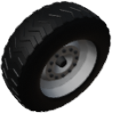

  

|Component|`BigWheel`|
|---|---|
|**Module**|`ARCHEAN_wheel`|
|**Mass**|400 kg|
|[**Size**](# "Based on the component's occupancy in a fixed 25cm grid.")|50 x 100 x 100 cm|
#
---

# Description
La Big Wheel es un componente que permite a una construcción acelerar hacia adelante/atrás, así como girar y frenar. Incluye una suspensión y caja de cambios configurables.

# Usage
Puede configurarse a través de su interfaz de configuración accesible mediante la tecla `V`.

### Interfaz de configuración
Proporciona información sobre la rueda y permite su configuración.
#### Información
- `Motor Rotation Speed`: Velocidad de rotación del motor en rotaciones por segundo.
- `Wheel Rotation Speed`: Velocidad de rotación de la rueda en rotaciones por segundo.
- `Power`: Consumo de energía en vatios.
- `Brake`: Valor de frenado de la rueda.
- `Ground Speed`: Velocidad de la rueda respecto al suelo en m/s.
- `Gear Ratio`: Relación de velocidad de la rueda.

#### Configuración
- `Reverse`: Invertir la dirección de rotación de la rueda.
- `Grip`: Ajusta el agarre de la rueda.
- `Suspension`: Ajusta la suspensión de la rueda.

### Energía
La Big Wheel solo puede alimentarse con alto voltaje a diferencia de la [Wheel](Wheel.md).
Consumirá hasta 400 kW a máxima potencia.

> - Puedes invertir la dirección de rotación de la rueda desde el menú de configuración accesible con la tecla `V`. Esto también ajusta la orientación del modelo, incluyendo el patrón de la banda de rodadura. Esta configuración no cambia la dirección de la rueda.

### List of inputs
|Channel|Function|Value|
|---|---|---|
|0|Accelerate|-1.0 to +1.0|
|1|Steer|-1.0 to +1.0|
|2|Regen|0 or 1|
|3|Brake|0.0 to 1.0|
|4|Gearbox|-1.0 to +1.0|

### List of outputs
|Channel|Function|Value|
|---|---|---|
|0|Wheel Rotation Speed|rot/s|
|1|Ground Friction|0 to 1|
