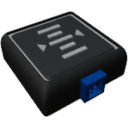

  

|Component|`AltitudeSensor`|
|---|---|
|**Module**|`ARCHEAN_sensor1`|
|**Mass**|1 kg|
|[**Size**](# "Based on the component's occupancy in a fixed 25cm grid.")|25 x 25 x 25 cm|
#
---

# Description
El sensor de altitud envía la altitud entre la posición del sensor y el suelo o el centro del cuerpo celeste a través de su puerto de datos.

# Usage
Una vez colocado en tu construcción, puede conectarse a un ordenador, por ejemplo, para obtener la altitud en metros. La orientación del sensor de altitud no tiene impacto en su funcionamiento.

### List of outputs
|Channel|Function|
|---|---|
|0|Absolute Altitude|
|1|Above Terrain|

>- En el modo "Above Terrain", el agua no se considera como terreno.
>- El sensor de altitud solo funciona en el entorno de un cuerpo celeste.
