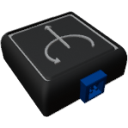

    

|Component|`AngularVelocitySensor`|
|---|---|
|**Module**|`ARCHEAN_sensor1`|
|**Mass**| 1 kg|
|[**Size**](# "Based on the component's occupancy in a fixed 25cm grid.")|25 x 25 x 25 cm|
#

---

# Description
El sensor de velocidad angular es un componente que mide la velocidad angular en 3 ejes (X, Y, Z) en rotaciones por segundo.

# Usage
Una vez colocado en tu construcción, el sensor puede conectarse a un ordenador para obtener la velocidad angular.

### List of outputs
|Channel|Function|Value|
|---|---|---|
|0|Angular velocity X|rot/s|
|1|Angular velocity Y|rot/s|
|2|Angular velocity Z|rot/s|
