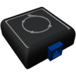

    

|Component|`LinearVelocitySensor`|
|---|---|
|**Module**|`ARCHEAN_sensor1`|
|**Mass**| 1 kg|
|[**Size**](# "Based on the component's occupancy in a fixed 25cm grid.")|25 x 25 x 25 cm|
#

#
---

# Description
El Linear Velocity Sensor es un componente que mide la velocidad lineal en 3 ejes (X, Y, Z) en metros por segundo.

# Usage
Una vez colocado en tu construcción, el sensor puede conectarse a un ordenador para obtener la velocidad lineal.

### List of outputs
|Channel|Function|value|
|---|---|---|
|0|Linear Velocity X|m/s|
|1|Linear Velocity Y|m/s|
|2|Linear Velocity Z|m/s|
