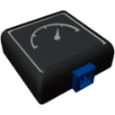

  

|Component|`SpeedSensor`|
|---|---|
|**Module**|`ARCHEAN_sensor1`|
|**Mass**|1 kg|
|[**Size**](# "Based on the component's occupancy in a fixed 25cm grid.")|25 x 25 x 25 cm|
#
---

# Description
El sensor de velocidad permite enviar la velocidad relativa al objeto padre (Planeta, nave nodriza...) a través de su puerto de datos.

# Usage
Una vez colocado en tu construcción, puede conectarse a un ordenador, por ejemplo, para obtener tu velocidad en metros por segundo. La orientación del sensor de velocidad no tiene impacto en su funcionalidad.
