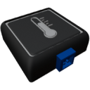

  

|Component|`TemperatureSensor`|
|---|---|
|**Module**|`ARCHEAN_sensor1`|
|**Mass**|1 kg|
|[**Size**](# "Based on the component's occupancy in a fixed 25cm grid.")|25 x 25 x 25 cm|
#
---

# Description
El sensor de temperatura es un componente que mide la temperatura del entorno en el que está colocado.

# Usage
Una vez colocado en tu construcción, puede conectarse a un ordenador, por ejemplo, para obtener la temperatura del entorno. La temperatura se proporciona en Kelvin.

### List of outputs
|Channel|Function|Value|
|---|---|---|
|0|Temperature (K)|number|
