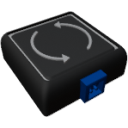

  

|Component|`TiltSensor`|
|---|---|
|**Module**|`ARCHEAN_sensor1`|
|**Mass**|1 kg|
|[**Size**](# "Based on the component's occupancy in a fixed 25cm grid.")|25 x 25 x 25 cm|
#
---

# Description
El sensor de inclinación permite enviar a través de su puerto de datos la inclinación actual basada en el horizonte.

# Usage
Una vez colocado en tu construcción, puede conectarse a un ordenador, por ejemplo, para obtener tu inclinación entre `-1.0` y `+1.0`.
Su eje largo debe usarse como un indicador de nivel.
`-1.0` o `+1.0` significa inclinado a 90 grados con un extremo apuntando perfectamente hacia abajo y otro perfectamente hacia arriba, mientras que `0.0` significa nivelado con el horizonte.

> No funciona en el espacio
