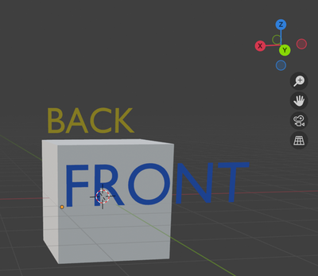

# Modelado 3D con Blender

## Instalacion del plugin

Aqui hay dos formas de instalar el plugin en Blender.

### Metodo 1: Instalar desde ZIP

1. Ve al repositorio del plugin [Archean Blender Plugin](https://github.com/batcholi/archean_blender_plugin)
2. Haz clic en el boton verde "Code" y elige "Download ZIP"
3. Abre Blender
4. En Blender, ve a Edit > Preferences > Add-ons
5. Elige "Install from Disk," luego selecciona el archivo ZIP que descargaste

   
6. Despues de que la instalacion termine, habilita el plugin en la lista de add-ons.

### Metodo 2: Instalar clonando el repositorio
1. Abre una terminal en tu sistema.
2. Clona el repositorio del plugin en la carpeta de add-ons de Blender ejecutando:
   ```bash
   git clone https://github.com/batcholi/archean_blender_plugin <addons_path>
   ```
3. Inicia Blender y confirma que el plugin aparece en la lista de add-ons.
4. Habilita el plugin si es necesario.

<font color="orange">Para usuarios de Windows:</font> Instala **Git** y usa `Git Bash` para clonar el repositorio. En el simbolo del sistema (CMD), Git no sera reconocido si la ruta del ejecutable no se ha agregado a la variable de entorno.

---

## Vista general del plugin

El plugin agrega dos nuevos elementos a Blender:
1. En el menu "Add" mientras estas en modo Object, un nuevo tipo de objeto **Archean Entity**, que agrega una estructura base para crear un nuevo componente.

	

2. En el viewport, aparece un menu **Archean** con varias configuraciones.

	

## Usar el plugin

Una entidad de Archean siempre esta compuesta por una estructura especifica. Aqui estan sus elementos:

*Los elementos marcados en <font color="green">verde</font> son requeridos, los marcados en <font color="orange">naranja</font> son opcionales.*
- **<font color="green">Entity Root</font>**: El objeto raiz de la entidad. Es crucial para la exportacion y siempre debe estar presente.
- **<font color="green">Renderable</font>**: Un objeto hijo del Entity Root. Este es el objeto que sera visible en el juego. Puedes tener varios, pero recomendamos optimizar para mantener la menor cantidad posible.
- **<font color="orange">Collider</font>**: Un hijo del Entity Root que define el area de colision. Un collider puede contener de 6 a 8 vertices. Puedes colocar varios colliders en una entidad, pero recomendamos mantener ese numero bajo por razones de rendimiento.
- **<font color="orange">Adapter</font>**: Un hijo del Entity Root, usualmente combinado con un **Single Arrow**, que define puntos de conexion usados para cables de datos, energia, fluidos u objetos.
- **<font color="orange">Joint</font>**: Un objeto hijo del Entity Root que, usualmente combinado con un **Single Arrow**, define puntos de articulacion para animar partes de la entidad a traves de traslacion o rotacion. Un joint se convierte en el padre de cualquier objeto incluido dentro de el, incluyendo otros joints.
- **<font color="orange">Target</font>**: Un objeto hijo del Entity Root que, frecuentemente combinado con un **Single Arrow**, define una posicion y direccion que puede usarse para agregar funcionalidad con XenonCode.

### Vista general de parametros
Dependiendo de si has seleccionado el Entity Root o uno de sus hijos, la lista de configuraciones disponibles cambia.
#### Botones del menu Entity Root
- **Export this Entity and Save**: Exporta la entidad a la carpeta donde se guardo el archivo .blend y luego guarda el archivo.
- **Generate Thumbnail**: Genera una miniatura de la entidad, que se usa como su icono en el juego.
#### Parametros del Entity Root
- **Is Entity Root**: Marca esta casilla para marcar el objeto como Entity Root. Esto desbloquea las funcionalidades especificas de entidad.
- **Mass (kg)**: La masa de la entidad en kilogramos.
- **Airtight**: Define si la entidad sera hermetica dentro del sistema de construccion de Archean. Recuerda que el volumen considerado es el del collider, no el del renderable. Si no hay collider presente durante la exportacion, el juego crea uno automaticamente que engloba la entidad.
- **Base Plane is Minus Y**: Por defecto, el plano base de la entidad se alinea con el eje -Z. Marca esta casilla para alinearlo con el eje -Y.
- **Export Vertex UVs**: Marca esto para exportar coordenadas UV. Es particularmente importante cuando se usan pantallas, texturas...

#### Boton del menu de objeto hijo
- **Create Default Materials**: Archean usa una paleta especifica para entidades, puertos y mas. Haz clic en este boton para generar los materiales predeterminados automaticamente.
#### Parametros de objeto hijo
- **Is Renderable**: Indica que este objeto sera renderizado en el juego. Aparece un sub-parametro **Export Sharp Edges**, que te permite exportar bordes marcados como "Sharp" en Blender para que aparezcan como wireframe en hologramas en el juego.
- **Is Joint**: Marca el objeto como un joint. Aparece una lista de sub-parametros para habilitar restricciones de rotacion y traslacion.
- **Is Target**: Marca el objeto como un target utilizable para funcionalidad. Su posicion y direccion importan segun el uso.
- **Is Collider**: Marca el objeto como un collider. Los colliders deben ser simples y contener entre 6 y 8 vertices. Aparece un sub-parametro **Is Build Block** para que el collider tambien pueda actuar como bloque de construccion, permitiendo que entidades o bloques se ajusten a el manteniendose alineados con la cuadricula de Archean.
- **Is Adapter**: Marca el objeto como un punto de conexion para cables de datos, energia, fluidos u objetos. Un sub-parametro desplegable y un boton **Create Mesh** te permiten generar la malla del conector directamente.

> El equipo de desarrollo de Archean usualmente se basa en objetos **Single Arrow** para adapters, joints y targets porque son simplemente una posicion y una direccion.

---

## Crear tu primera entidad

El primer paso importante es orientarte correctamente en el espacio 3D. En Archean, el eje Y es adelante/atras, el eje X es izquierda/derecha y el eje Z es arriba/abajo.



1. Abre Blender y crea una nueva escena.
2. Elimina todo lo que hay actualmente en la escena (por defecto un cubo, una camara y una luz).
3. En el menu "Add" en modo Object, agrega una nueva **Archean Entity**.

   Este objeto inicial contiene un **Entity Root** y un cubo simple marcado como **Renderable**. El nombre del Entity Root es el nombre de la entidad usado para la exportacion y en el juego.

   > El nombre del **Entity Root** no debe contener espacios ni caracteres especiales — solo caracteres alfanumericos.
4. Escala el cubo a `0.5 x 0.5 x 0.5`, es decir, `50 x 50 x 50 cm`, porque el cubo por defecto es demasiado grande. *(Son 2 x 2 x 2 metros en el juego.)*
5. Guarda el proyecto en una carpeta antes de continuar para poder exportar la entidad mas tarde.
   > - Guarda el proyecto en la carpeta de tu componente: `Archean/Archean-data/mods/MYVENDOR_mymod/components/MyComponentName/`
   > - Consulta [Getting Started](getting-started.md) para saber como crear un mod y configurar esta estructura de carpetas.
   > - <font color="orange"> Un mod puede contener multiples componentes, cada uno en su propia carpeta.</font>
   > - <font color="red">/!\ El nombre de la carpeta del componente debe coincidir con el nombre del Entity Root.</font>

### Agregar el puerto de datos
Agrega un objeto **Single Arrow** en una cara del cubo para crear un puerto de datos. Genera su malla, asigna el material correcto y unelo al objeto principal para evitar crear un renderable separado. Como los puertos a menudo usan sombreado suave, aplica un modificador "Edge Split" al objeto principal para prevenir artefactos visuales.

<video src="./blender-res/dataport.mp4" width="700" height="438" controls loop muted></video>

### Agregar un joint para rotar a Suzanne
Agrega un objeto **Single Arrow** en la parte superior del cubo para definir un punto de articulacion. Marcalo como **Is Joint** y habilita la rotacion solo alrededor del eje Z. Luego emparenta los objetos hijos del joint — Suzanne (la cabeza de mono de Blender) y un cilindro para la base.

Como Suzanne puede rotar completamente, establece **-360** como valor **Low**, **0** como **Neutral** (posicion predeterminada) y **360** como **High**.

<video src="./blender-res/joint.mp4" width="700" height="438" controls loop muted></video>

### Agregar una pantalla
Para el ejemplo, crea un objeto que servira como base para la pantalla. Primero asigna un material que parezca una pantalla, luego despliega el UV seleccionando la cara de la pantalla para que llene todo el editor UV.

> Asegurate de habilitar **Export Vertex UVs** en el Entity Root para que se exporten las coordenadas UV.
> La apariencia del material de la pantalla depende de ti; por ejemplo, puedes convertir una superficie de vidrio en una pantalla.

<video src="./blender-res/screen.mp4" width="700" height="438" controls loop muted></video>

### Agregar un collider
Para terminar, agrega un collider que defina el area de colision de la entidad. Agrega un cubo, escalalo para encerrar toda la entidad y posicionalo correctamente. Marcalo como **Is Collider** y ocultalo en el viewport.

<video src="./blender-res/collider.mp4" width="700" height="438" controls loop muted></video>

### Gestion de puertos para XenonCode
El nombre de los puertos sigue una convencion especifica para facilitar su identificacion dentro de XenonCode. Asi es como funciona:
- Los puertos de datos deben llamarse **data** usando el formato `data.index`, o simplemente `data` si solo hay uno. Este nombre es requerido para que puedan accederse usando `input.index` y `output.index` en XenonCode.
  Ejemplo con dos puertos de datos: Nombralos `data.0` y `data.1`. En XenonCode, los accederias usando `input.0` e `input.1`.
  Ejemplo con un unico puerto de datos: Simplemente nombralo `data`. En XenonCode, lo accederias usando `input.0` y `output.0`.

- Todos los demas tipos de puertos (Power, Fluid, Item, etc.) no tienen requisitos especificos de nombre. Su nombre declarado se usa directamente en XenonCode.

### Generar la miniatura y exportar
Una vez que todo este configurado, genera la miniatura y exporta la entidad.
- Renombra el Entity Root correctamente.
- Asegurate de que Suzanne este marcada como Renderable.

<video src="./blender-res/suzanne.mp4" width="700" height="438" controls loop muted></video>

## Preguntas frecuentes
### Por que a veces veo un mensaje "Fix now" en el menu del plugin?
Los objetos necesitan tener su escala aplicada para evitar problemas de exportacion. El boton "Fix now" aplica la escala a todos los objetos de la escena de una vez. Usualmente puedes prevenir el mensaje aplicando la escala de un objeto con **Ctrl + A** y eligiendo **Apply > Scale**.

### La orientacion de la miniatura no me conviene. Como la cambio?
Rota el Entity Root para cambiar como se enmarca la miniatura. Recomendamos nunca aplicar esa rotacion para poder devolver la entidad a su orientacion original facilmente. Solo necesitas regenerar la miniatura cuando los visuales cambien.

### Por que deberia evitar crear demasiados Renderables?
El motor de renderizado de Archean es 100% ray tracing, por lo que el numero de vertices importa poco. El numero de objetos, sin embargo, tiene un impacto directo en el rendimiento. Ten en cuenta que `Numero de Renderables = renderables por entidad * numero de entidades` dentro de un radio de aproximadamente 100 km, dependiendo del tamano final de la entidad. *(Cuanto mayor sea la entidad, mayor sera el radio de renderizado.)*

### Es mejor mostrar texto como textura o como malla?
Gracias al ray tracing, el texto como malla es a menudo mas eficiente y se ve mejor porque ofrece mayor calidad visual y consume poca VRAM comparado con las texturas.

### Estoy acostumbrado a hacer assets low-poly para juegos. Deberia hacer lo mismo para Archean?
En absoluto — puedes crear modelos muy detallados. El ray tracing ofrece una calidad visual extremadamente alta. Dato curioso: Blender probablemente se colgara antes que Archean. Diviertete con esos vertices!

### Que colores usan los componentes oficiales?
Cuando generas materiales usando **Create Default Materials**, **Color1** es el blanco usado en la mayoria de componentes, **Color2** es el gris metalico, y **Body** es el negro. Los otros materiales tienen nombres autoexplicativos.
