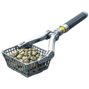

    

|Item|`RockRakeTool`|
|---|---|
|**Module**|`ARCHEAN_celestial`|

---

# Description
El RockRake Tool es una herramienta que te permite recoger rocas del suelo mas rapido que a mano. Se utiliza principalmente en modo aventura como un nivel intermedio entre la recoleccion manual y el taladro de mineria.

# Usage
El RockRake Tool ofrece dos ventajas principales sobre la recoleccion manual:
- Mantener presionado el `boton izquierdo del raton` te permite recoger rocas continuamente, mientras que la mano solo puede recoger una a la vez.
- El `boton derecho del raton` te permite conocer la composicion de la roca apuntada.
