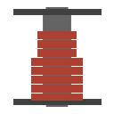

  

|Item|`SpoolTool`|
|---|---|
|**Module**|`ARCHEAN_build`|

# Description
El Spool Tool se utiliza para colocar cables y tuberias que conectan componentes entre si, permitiendo la transferencia de datos, energia, objetos o fluidos entre ellos.

# Spool Types
Presiona **C** para abrir el menu de seleccion de spool. Hay 5 tipos de spools disponibles:

  
  
  
  
  

|Tipo|Color|Uso|
|---|---|---|
|**Data Cable**|Azul|Conectar puertos de datos para transferencia de informacion|
|**Low Voltage Cable**|Rojo|Conectar puertos de energia de bajo voltaje|
|**High Voltage Cable**|Naranja|Conectar puertos de energia de alto voltaje|
|**Fluid Pipe**|Gris|Conectar puertos de fluidos para transferencia de liquidos/gases|
|**Item Conduit**|Gris oscuro|Conectar puertos de objetos para transferencia de objetos|

Cada tipo de spool solo puede conectar puertos compatibles. Los spools se pueden apilar en tu inventario y la longitud restante se muestra en cada objeto spool.

# Usage

## Selecting Spool Type
Presiona **C** para abrir el menu de seleccion de spool y elegir el tipo de cable que deseas colocar.

## Creating a Cable (Connecting Two Components)
1. Apunta al conector de un componente y haz **clic izquierdo** para iniciar el cable
2. Haz clic para agregar puntos intermedios y dar forma a la ruta del cable
3. Apunta al conector de destino y haz **clic izquierdo** para completar la conexion

Durante la creacion del cable:
- **Clic derecho** elimina el ultimo punto colocado (o cancela si no hay puntos)
- La **rueda del raton** alterna entre rutas alternativas de busqueda automatica de caminos
- Manten **Shift** para ajustar los cables a las superficies de los componentes
- Manten **X** para colocar el cable en la cara interior de los bloques/componentes

## Auto Path-Finding
El Spool Tool cuenta con busqueda automatica de caminos que sugiere rutas para los cables. Usa la **rueda del raton** durante la colocacion para alternar entre diferentes permutaciones de ruta.

## Creating a Flexible Cable
Para conectar componentes en diferentes construcciones:
1. Inicia el cable en una construccion
2. Terminalo en el componente de otra construccion

Esto crea un **Flexible Cable** que:
- Vincula las dos construcciones fisicamente
- Esta restringido por el motor de fisicas
- No tiene limite de fuerza (no se desprendera)
- Se ve afectado por la gravedad

Tambien puedes crear un cable flexible entre dos componentes de la **misma construccion** manteniendo **X**.

## Deleting a Cable
Manten **clic derecho** y luego presiona rapidamente **clic izquierdo** en un cable existente para eliminarlo.

## Painting Cables
Usa el [Paint Tool](PaintTool.md) para personalizar la apariencia de los cables:
- La pintura normal cambia el color del cable
- Manten **Shift** para un efecto de rayas
- Manten **X** para reemplazar el color en todos los cables coincidentes
- Combina ambos para rayas transparentes

---

> **Consejos:**
> - Si un cable se niega a crearse, es posible que no tengas suficiente longitud restante en tu spool
> - Los cables no tienen limite de transferencia ni perdida relacionada con la longitud
> - Los cables no determinan la direccion de transferencia
> - Un cable no puede modificarse una vez colocado - debes eliminarlo y recrearlo
> - Los cables flexibles afectan mas al rendimiento que los cables normales - prioriza los cables normales cuando sea posible
> - Las herramientas pueden usar objetos de contenedores externos colocando la herramienta dentro de ese contenedor
