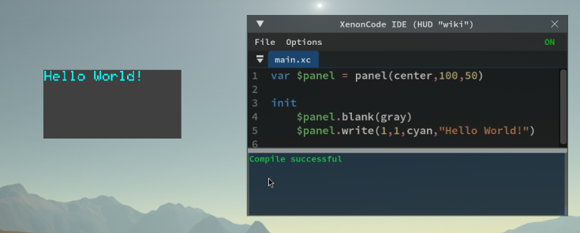

# Gestion del HUD en Archean
## Introduction
El sistema HUD (Heads-Up Display) permite a los jugadores crear sus propias interfaces graficas para mostrar informacion en la pantalla como textos, botones, dibujos... usando XenonCode.

Los HUDs son gestionados completamente por el cliente, lo que significa que cada jugador tiene sus propios HUDs y otros jugadores no pueden verlos. Sin embargo, pueden comunicarse con [Beacon](../components/navigation/Beacon.md) u otros jugadores a traves de un sistema integrado que permite enviar y recibir datos en frecuencias.

Es importante notar que dado que los HUDs son completamente del lado del cliente, estaran disponibles en todos los servidores/mundos a los que te conectes. No puedes configurarlos para un servidor/mundo especifico excepto manualmente como se indica en la siguiente seccion.

> Informacion adicional:
> - Al usar un boton o cualquier otra interaccion en un HUD, se prefiere el `clic derecho` para evitar capturar la vista del raton.

## Crear un HUD
Dado que los HUDs son una funcionalidad completamente del lado del cliente, no tienen objetos directamente asociados en el juego. Para crear un HUD, necesitas ir al menu de configuracion del juego `F1` e ir a la pestana `HUD`.


Desde este menu, puedes crear tantos HUDs como desees y activarlos/desactivarlos a tu conveniencia usando la casilla de verificacion. Es importante saber que cada HUD es una instancia unica y no se comunica nativamente con otros HUDs, aunque la comunicacion es posible a traves de una funcionalidad que se explicara mas adelante en esta pagina.

Una vez creado tu HUD, puedes abrir su IDE para programar tus funcionalidades.

## Crear tu primera interfaz grafica
Los HUDs usan paneles para mostrar contenido en la pantalla. Un panel puede contener elementos graficos como textos, botones, dibujos...

Puedes crear tantos paneles como desees y posicionarlos en la pantalla como te parezca conveniente.
Para crear un panel, la sintaxis es similar a lo que puedes encontrar en una pantalla de [dashboard](dashboard.md).

```xc
var $panel = panel(center, sizeX, sizeY)
```

Ejemplo de un HUD que muestra "Hello World" en el centro de la pantalla en un cuadro gris de 100x50 pixeles

```xc
var $panel = panel(center, 100, 50)

init
    $panel.blank(gray)
    $panel.write(1, 1, cyan, "Hello World")
```



# Lista de funciones especificas para HUDs

### Funciones relacionadas con la ventana del juego
```xc
screen_w ; returns the width of the game window
screen_h ; returns the height of the game window
screen_ratio ; returns the aspect ratio of the screen (width/height)
fov ; returns the player's camera field of view (radians)
aim_distance ; returns the distance of whatever the player is aiming at in meters

mouse_x ; returns the x position of the mouse on the game window
mouse_y ; returns the y position of the mouse on the game window

set_resolution_scale($scale)
; Sets the internal resolution of the HUD, from 1 (full resolution) to 8 (lower resolution).
; Default is 2. The HUD is rendered at screen resolution divided by $scale.
; Final display size is affected by ($scale * ui_scaling).
```
> Es importante recordar que el escalado de UI configurado en los ajustes del juego influye en los valores devueltos por estas funciones.

### Funciones relacionadas con paneles
```xc
var $myPanel = panel(center, $width, $height) ; creates a panel centered on the screen of size width, height
; 'Center' can be replaced by 'Top', 'top_left', 'top_right', 'bottom', 'bottom_left'...

$myPanel.set_position($x, $y) ; moves the panel to position x, y
$myPanel.set_size($width, $height) ; resizes the panel to size width, height

$myPanel.width ; returns the width of the panel
$myPanel.height ; returns the height of the panel
$myPanel.x ; returns the x position of the panel
$myPanel.y ; returns the y position of the panel
$myPanel.scroll ; returns the mouse scroll value (-1, 0, or 1)

; ENTRY POINT
click.$myPanel ($x:number, $y:number) ; returns the click position within the panel
```
Nota: La forma de dibujar en el panel es similar a las [funciones de renderizado de pantalla del dashboard](../xenoncode/dashboard.md#screen-rendering-functions)

### Funciones relacionadas con el ordenador integrado
```xc
set_cps(25) ; sets the number of HUD cycles per second
tick ; returns the current tick index
language ; returns the player's current language code (e.g., "en", "fr")
mouse_look() ; returns 1 if mouse look is active, 0 otherwise
```

### Funciones relacionadas con la comunicacion
```xc
var $beacon = beacon($transmitFreq, $receiveFreq) ; Allows sending/receiving data

var $data = $beacon.data ; returns the data received by the beacon
var $distance = $beacon.distance ; returns the distance between the player and the remote beacon
var $dir_x = $beacon.direction_x ; returns the x direction between the player and the remote beacon
var $dir_y = $beacon.direction_y ; returns the y direction between the player and the remote beacon
var $dir_z = $beacon.direction_z ; returns the z direction between the player and the remote beacon
var $is_recv = $beacon.is_receiving ; whether this beacon is receiving data on the receiving frequency

$beacon.transmit($data) ; sends data on the transmission frequency
```

# Shared Values
Los Shared Values son una funcionalidad que permite obtener y establecer informacion en el cliente del jugador.

Una lista de valores compartidos esta disponible de forma nativa para permitirte obtener informacion sobre el entorno del jugador.

```xc
var $comp = get("avatar_sensor_environment_composition") ; returns the composition of the player's environment
var $density = get("avatar_sensor_density") ; returns the density of the player's environment
var $temp = get("avatar_sensor_temperature") ; returns the temperature of the player's environment in Kelvin
var $gravity = get("avatar_sensor_gravity") ; returns the gravity of the player's environment
var $speed = get("avatar_sensor_speed") ; returns the player's speed in m/s
var $alt = get("avatar_sensor_altitude") ; returns the player's altitude in meters
var $alt = get("avatar_sensor_altitude_absolute") ; returns the player's absolute altitude in meters
var $view = get("avatar_is_3rd_person") ; returns whether the player is in third person view

var $inv = get("avatar_inventory") ; returns the player's inventory as a string of key values
var $belt = get("avatar_belt") ; returns the content of the belt as a string of key values
var $mass = get("avatar_mass") ; returns the mass of the avatar including inventory in kg (Avatar base mass is 100kg)
var $water = get("avatar_water_level") ; returns the player's water level
var $o2 = get("avatar_oxygen_level") ; returns the player's oxygen level
var $h2 = get("avatar_hydrogen_level") ; returns the player's hydrogen level
```

## Crear tus propios valores compartidos
Es posible crear tus propios valores compartidos para transmitir/recibir, por ejemplo, informacion entre HUDs.
```xc
set("mySharedValue", "Hello World") ; sets a shared value identified by "mySharedValue" with the value "Hello World"
get("mySharedValue") ; returns the value of the shared value "mySharedValue"
```

# Virtual screen y screencopy
Estas funciones estan disponibles en los HUDs y funcionan de la misma manera que en los computers.
Consulta la documentacion para [virtualscreen](../xenoncode/computer.md#virtual-screen-function) y [screen_copy](../xenoncode/computer.md#screen-rendering-functions-draw-on-a-virtual-screen).

# Examples
### HUD que muestra la velocidad del jugador
```xc
var $panel = panel(top,100,12)

tick
	$panel.blank()
	$panel.text_align(top)
	$panel.write(1,1,cyan,text("Speed: {0} km/h", get("avatar_sensor_speed")*3.6))
```
<video controls width="600">
    <source src="hud-img/speedDemo.mp4" type="video/mp4">
</video>

### HUD que apunta a un beacon y muestra la distancia
```xc
var $panel = panel(center, 50,50)
var $beacon = beacon("", "target")

function @target_beacon($b:beacon, $p:panel, $width:number, $height:number, $color:number)
    if $b.direction_z > 0
        var $f = screen_w / (2 * tan(fov / 2))
        var $rz = $b.direction_z * (screen_w / screen_h)
        var $x_proj = ($b.direction_x * $f) / $rz
        var $y_proj = ($b.direction_y * $f) / $rz
        var $x = screen_w / 2 + $x_proj - $width / 2
        var $y = screen_h / 2 - $y_proj - $height / 2
        $p.set_position($x, $y)
        $p.set_size($width, $height)
        $p.blank()
        $p.draw_rect(0, 0, $width, $height, $color)
        $p.text_align(center)
        $p.write(text("{0.0} m", $b.distance))

tick
    @target_beacon($beacon, $panel, 50, 50, green)
```
<video controls width="600">
    <source src="hud-img/targetDemo.mp4" type="video/mp4">
</video>
