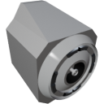

  

|Composant|`DockingPort`|
|---|---|
|**Module**|`ARCHEAN_build`|
|**Masse**|50 kg|
|[**Taille**](# "Basée sur l'occupation du composant dans une grille fixe de 25 cm.")|50 x 50 x 50 cm|
|**Push/Pull Fluid**|Accept Push/Pull -> Forwards action to other side|
#
---

# Description
Le DockingPort est un composant qui permet de connecter deux constructions ensemble. La connexion permet le transfert de données, d'énergie, de fluides et d'**objets** entre les constructions connectées, mais elle les contraint également physiquement ensemble. Elles sont solidaires l'une de l'autre.

# Usage
Le DockingPort n'a pas besoin d'être alimenté.
Le connecteur de données séparé permet de contrôler le DockingPort, tandis que les autres connecteurs permettent de brancher divers câbles qui transféreront des données, de l'énergie ou des fluides vers/depuis l'autre DockingPort.

### Mode de transfert
Le DockingPort peut fonctionner selon deux modes de transfert, configurables via le menu GetInfo (touche `V`) :
- **Fluid Mode** (par défaut) : Transfère les fluides entre les ports amarrés
- **Item Mode** : Transfère les objets entre les ports amarrés

> Les deux DockingPort doivent être configurés sur le même mode pour que les transferts fonctionnent.

> Le DockingPort ne peut s'amarrer qu'à un autre DockingPort.

### Utilisation avec les alias
L'utilisation d'alias par défaut n'est pas possible pour les deux ports simultanément car l'objet n'affichera qu'un seul champ d'alias dans sa fenêtre d'information (`V`). De même, le [Router](../computers/Router.md) n'affiche qu'un seul champ d'alias par composant.
Pour utiliser séparément les ports de données avec des alias, vous devez utiliser un [Data Bridge](../computers/DataBridge.md) ou une [DataJunction](../computers/DataJunction.md). Cela vous permet d'attribuer des alias à ces objets au lieu des ports d'amarrage.

### Liste des sorties
|Canal|Fonction|
|---|---|
|0|Est amarré

### Liste des entrées
|Canal|Fonction
|---|---|
|0|Armer/Désarmer l'amarrage

