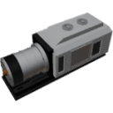

  

|Composant|`DieselGenerator`|
|---|---|
|**Module**|`ARCHEAN_combustion`|
|**Masse**|1000 kg|
|[**Taille**](# "Basée sur l'occupation du composant dans une grille fixe de 25 cm.")|250 x 100 x 100 cm|
|**Push/Pull Fluid**|Accept Push / Initiate Push/Pull|
#
---

# Description
Le Diesel Generator est un groupe électrogène qui brûle du carburant liquide pour produire de l'énergie haute tension.
Il peut délivrer jusqu'à **150 kW** et son carburant de référence est le dodécane (C12H26).

# Usage
Connectez une source de carburant à son port de fluide, de la basse tension pour le démarreur, et envoyez 1 dans le port de données pour le mettre en marche.

Le démarreur consomme 1000 watts en basse tension pendant le lancement uniquement. Avec du carburant disponible, le moteur démarre en moins d'une seconde.

L'énergie produite est délivrée sur la sortie haute tension. La consommation de carburant suit la charge : environ 10 g/s à pleine puissance et 27 % de cette valeur au ralenti.

Le moteur respire l'air ambiant par sa prise d'air et rejette ses gaz d'échappement par sa sortie. Les ports d'air et d'échappement permettent de les raccorder à des tuyaux à la place ; une prise d'air raccordée remplace l'air ambiant. La puissance disponible diminue avec la quantité d'oxygène dans l'air.

Le moteur cale s'il manque d'oxygène, si son échappement est bouché ou si le carburant vient à manquer plus d'une seconde. Après un calage, envoyez 0 puis 1 dans le port de données pour le relancer.

Il tolère jusqu'à 55 % de contamination du carburant (eau, hydrocarbures lourds) sans usure. Au-delà, il s'use.

### Liste des entrées
|Canal|Fonction|Plage|
|---|---|---|
|0|Run|0 ou 1|

### Liste des sorties
|Canal|Fonction|Valeur|
|---|---|---|
|0|Load|0.0 à 1.0|
|1|RPM|tours/min|
|2|Fuel flow|kg/s|
|3|Running|0 ou 1|
|4|State|"Off", "Starting", "Running", "Stalled", "Destroyed"|
