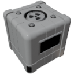

  

|Composant|`FissionReactor`|
|---|---|
|**Module**|`ARCHEAN_nuclear`|
|**Masse**|1000 kg|
|[**Taille**](# "Basée sur l'occupation du composant dans une grille fixe de 25 cm.")|300 x 300 x 275 cm|
|**Push/Pull Fluid**|Accept Push / Initiate Push|
#
---

# Description
Le FissionReactor est un composant qui produit de la chaleur à partir de la fission nucléaire de barres d'uranium.

---

# Usage

## Fonctionnement général
Le réacteur chauffe l'eau (H₂O) en utilisant l'énergie générée par la fission nucléaire.

L'eau a un double rôle :
- Refroidir le coeur du réacteur.
- Produire de la vapeur pour les turbines.

---

## Ressources nécessaires
Le réacteur nécessite :
- Une alimentation continue en basse tension de **1000 W**.
- Un apport en eau froide.
- Des barres d'uranium placées dans les 4 zones internes du réacteur.

> Il est fortement recommandé d'avoir au moins une barre d'uranium par zone.
> Un réacteur avec des zones vides fonctionnera très mal ou pas du tout.

---

## Inventaire et zones
Le réacteur dispose de **40 emplacements**, répartis en **4 zones indépendantes**.

Chaque zone influence sa puissance locale et sa température en fonction du nombre et du type de barres d'uranium placées.

---

## Barres de contrôle
Chaque zone possède une *barre de contrôle* réglable :
- 0% rétractée (entièrement insérée) -> Réaction arrêtée.
- 100% rétractée -> Réaction maximale.

---

## Démarrage de la réaction
Une injection manuelle de neutrons est nécessaire via le port de données.

Jusqu'à **1000 neutrons** par seconde peuvent être envoyés pendant le démarrage
(jusqu'à **250 neutrons** par seconde par zone).

> - Même avec de l'uranium à 100% U235, un apport initial de neutrons est nécessaire.
> - Avec de l'uranium faiblement enrichi (10% U235), le démarrage peut nécessiter quelques minutes d'injection continue de neutrons.

---

## Comportement de la réaction en chaîne

Bien que chaque zone du réacteur possède ses propres barres d'uranium, sa température et sa population de neutrons, le réacteur est conçu pour simuler une réaction en chaîne réaliste à travers l'ensemble du coeur.

- Les zones ne sont pas complètement isolées.
- Les neutrons produits dans une zone peuvent partiellement se propager aux zones voisines.
- Ce comportement améliore la stabilité de la réaction et aide les zones plus faibles à maintenir la fission.

> Une zone très active peut soutenir une zone moins active, mais avoir toutes les zones correctement alimentées reste essentiel pour une efficacité maximale.

---

## Refroidissement et production de vapeur
Lorsqu'il est utilisé avec des [Steam Turbines](SteamTurbine.md), la température idéale de sortie de l'eau est de **650 K**.

- En dessous -> Production d'énergie réduite.
- Au-dessus -> Perte d'efficacité (aucun gain supplémentaire).

> Un débit d'eau excessivement élevé peut trop refroidir le réacteur et limiter la puissance de sortie.

---

## États du réacteur

|État|Signification|
|---|---|
|IDLE|Le réacteur est éteint.|
|STARTING|Démarrage en cours (injection de neutrons).|
|ACTIVE|Réaction nucléaire active (des neutrons sont produits).|
|COOLDOWN|Refroidissement en cours (aucun neutron produit).|
|HOT|Le réacteur est chaud, veuillez augmenter le débit de fluide.|
|SCRAM|Arrêt d'urgence déclenché (barres de contrôle verrouillées à 0% de rétraction).|
|CRITICAL|Le coeur du réacteur est en surchauffe grave, fusion imminente.|
|MELTDOWN|Fusion du coeur. Réacteur inutilisable sans réinitialisation manuelle.|

---

## Sécurité et fusion
- Au-dessus de **1200 K** -> Entre en état *CRITICAL* - fusion imminente.

En *MELTDOWN* :
- Le flux de vapeur s'arrête - aucune énergie ne peut être produite.
- Le réacteur devient inutilisable jusqu'à réinitialisation manuelle.

### Réinitialisation après fusion
Via le bouton de réinitialisation dans l'interface du réacteur (touche `V`).

> - En mode créatif, ce bouton est toujours disponible.
> - En mode aventure, il n'est disponible que lorsque le réacteur est entré en fusion.

---

# Usure des barres d'uranium

Les barres d'uranium se dégradent lentement au fil du temps en participant à la réaction nucléaire.

### Consommation des isotopes
- L'**U235** est progressivement consommé pour maintenir la fission.
- L'**U238** peut également se transformer partiellement en plutonium.

### Produits de fission
Pendant le fonctionnement, les barres accumulent automatiquement des produits de fission :
- **Xénon (Xe)**
- **Plutonium (Pu)**

Ces éléments apparaissent directement dans la composition de la barre au fur et à mesure de son vieillissement.
> Il est important de noter que ces produits de fission n'ont actuellement aucune utilité dans le jeu. Pour obtenir du plutonium pour la fabrication du RTG, vous devez utiliser le processus de fabrication du plutonium décrit sur la page RTG [RTG](./RTG.md#how-to-produce-plutonium).

### Barre épuisée
Lorsque la concentration en **U235** d'une barre d'uranium descend en dessous de **4,45%**, elle devient *épuisée*.

> Une barre épuisée ne peut plus maintenir une réaction en chaîne, même avec un apport externe de neutrons.

### Facteurs d'usure
La durée de vie des barres d'uranium dépend entièrement de :
- Leur taux d'enrichissement initial en U235.
- La puissance réelle produite par le réacteur (donc le flux de neutrons).

> -> Plus l'enrichissement est faible et plus l'extraction de puissance est élevée, plus la barre s'usera rapidement.
> -> À l'inverse, une barre d'uranium fortement enrichie fonctionnant à puissance modérée peut durer extrêmement longtemps.

### Liste des entrées

|Canal|Fonction|Valeur|
|---|---|---|
|0|Barre de contrôle Zone 1|0.0 à 1.0|
|1|Barre de contrôle Zone 2|0.0 à 1.0|
|2|Barre de contrôle Zone 3|0.0 à 1.0|
|3|Barre de contrôle Zone 4|0.0 à 1.0|
|4|Injection de neutrons|0 à 1000|
|5|SCRAM (Arrêt d'urgence)|0 ou 1|

---

### Liste des sorties

|Canal|Fonction|Valeur|
|---|---|---|
|0|Température Zone 1 (Kelvin)|Nombre|
|1|Température Zone 2 (Kelvin)|Nombre|
|2|Température Zone 3 (Kelvin)|Nombre|
|3|Température Zone 4 (Kelvin)|Nombre|
|4|Position barre de contrôle Zone 1|0.0 à 1.0|
|5|Position barre de contrôle Zone 2|0.0 à 1.0|
|6|Position barre de contrôle Zone 3|0.0 à 1.0|
|7|Position barre de contrôle Zone 4|0.0 à 1.0|
|8|Flux de neutrons Zone 1|Nombre|
|9|Flux de neutrons Zone 2|Nombre|
|10|Flux de neutrons Zone 3|Nombre|
|11|Flux de neutrons Zone 4|Nombre|
|12|Température eau d'entrée (Kelvin)|Nombre|
|13|Température eau de sortie (Kelvin)|Nombre|
|14|Débit d'eau (kg/s)|Nombre|
|15|Statut du réacteur|"IDLE", "STARTING", "ACTIVE", "COOLDOWN", "HOT", "SCRAM", "CRITICAL", "MELTDOWN"|
|16|Durée de vie|Temps restant estimé en secondes|

---

# Fabrication des barres d'uranium

---

## Uranium faiblement enrichi (LEU)

|Étape|Entrées|Sorties|Température|
|---|---|---|---|
|Crusher (Uranium Powder)|Uranium Ore : 1000 g|Uranium powder (U235 : 10%, U238 : 90%) : 1000 g|-|
|ChemicalFurnace (Yellow Cake (U₃O₈))|Uranium powder : 0,714 g, Oxygen (O₂) : 0,128 g|Yellow Cake (U₃O₈) : 0,842 g|750K - 950K|
|ChemicalFurnace (Uranium Dioxide (UO₂))|Yellow Cake (U₃O₈) : 0,842 g, Hydrogen (H₂) : 0,004 g|Uranium dioxide (UO₂) : 0,810 g, Water (H₂O) : 0,036 g|850K - 1050K|
|Crafter (Uranium Rod LEU (UO₂))|Uranium dioxide (UO₂) : 1000 g|Uranium rod LEU (UO₂, U235 : 10%, U238 : 90%) : 1|-|

---

## Uranium hautement enrichi (HEU)

### Production de UF₆ (Gaz)

|Étape|Entrées|Sorties|Température|
|---|---|---|---|
|Crusher (Fluorite powder (F₂))|Fluorite Ore : 1000 g|Fluorite powder (F₂) : 1000 g|-|
|ChemicalFurnace (Hydrogen Fluoride (HF)) *|Fluorite powder (F₂) : 0,038 g, Hydrogen (H₂) : 0,002 g|Hydrogen fluoride (HF) : 0,040 g|300K - 400K|
|ChemicalFurnace (Uranium Tetrafluoride (UF₄))|Hydrogen fluoride (HF) : 0,080 g, Uranium dioxide (UO₂) : 0,270 g|Uranium tetrafluoride (UF₄) : 0,314 g, Water (H₂O) : 0,036 g|750K - 950K|
|ChemicalFurnace (Uranium Hexafluoride (UF₆))|Uranium tetrafluoride (UF₄) : 0,314 g, Fluorite powder (F₂) : 0,038 g|Uranium hexafluoride (UF₆) : 0,352 g|550K - 750K|

* La production de Hydrogen Fluoride (HF) déclenche une réaction hautement exothermique. Dans ce cas précis, la température résultante, même si le four chimique affiche des valeurs autour de 3000K, n'affecte pas la réaction chimique. Cependant, dans les processus suivants, vous devrez refroidir le HF avant de pouvoir l'utiliser, généralement avec un [Active Radiator](../fluids/radiator/ActiveRadiator.md) ou un dispositif de refroidissement similaire.

---

### Utilisation de la centrifugeuse d'enrichissement

|Caractéristique|Valeur|
|---|---|
|Consommation électrique|1000 W|
|Débit d'entrée|0,1 kg/s|
|Capacité interne|10 kg|

Fonctionnement :
- La première centrifugeuse reçoit l'hexafluorure d'uranium (UF₆) par le haut.
- La sortie lourde (bas) peut être éliminée car elle ne contiendra que de l'U238.
- La sortie légère peut être envoyée à une autre centrifugeuse pour un traitement ultérieur.

> Généralement, atteindre une concentration élevée en U235 nécessite une chaîne de 8 à 10 centrifugeuses.

---

### Retour à l'état solide et assemblage de la barre d'uranium HEU

|Étape|Entrées|Sorties|Température|
|---|---|---|---|
|ChemicalFurnace (Uranyl Fluoride (UO₂F₂))|Uranium hexafluoride (UF₆) : 0,352 g, Water (H₂O) : 0,036 g|Uranyl fluoride (UO₂F₂) : 0,308 g, Hydrogen fluoride (HF) : 0,080 g|300K - 350K|
|ChemicalFurnace (Uranium Dioxide (UO₂))|Uranyl fluoride (UO₂F₂) : 0,308 g, Hydrogen (H₂) : 0,002 g|Uranium dioxide (UO₂) : 0,270 g, Hydrogen fluoride (HF) : 0,040 g|750K - 850K|
|Crafter (Uranium Rod HEU (UO₂))|Enriched uranium dioxide (UO₂) : 1000 g|Uranium rod HEU (UO₂, U235 content depends on enrichment) : 1|-|
