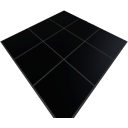

  

|Composant|`SolarPanel`|
|---|---|
|**Module**|`ARCHEAN_celestial`|
|**Masse**|25 kg|
|[**Taille**](# "Basée sur l'occupation du composant dans une grille fixe de 25 cm.")|200 x 200 x 25 cm|
#
---

# Description
Le SolarPanel génère de l'énergie basse tension. Il a un rendement de 99,9% et une surface de 4 mètres carrés (2x2 mètres).
La puissance de sortie sera limitée en fonction de sa distance et de son orientation par rapport au(x) soleil(s).
Avec la configuration par défaut du système solaire dans Archean, le soleil n'est qu'environ 25% aussi lumineux que notre vrai soleil. Sur la Terre d'Archean à l'intérieur de l'atmosphère dans les meilleures conditions, vous pouvez générer jusqu'à environ 980 watts par panneau.

# Usage
Connectez le SolarPanel au composant qui nécessite de l'énergie basse tension pour fonctionner.

Le SolarPanel possède deux ports électriques, ce qui vous permet de connecter deux composants simultanément ou de chaîner plusieurs panneaux solaires en série pour augmenter la puissance totale disponible.

### Liste des sorties
|Canal|Fonction|
|---|---|
|0|Puissance générée (Watts)|
|1|Puissance de sortie (Watts)|

> Si vous utilisez le SolarPanel pour alimenter deux composants, la puissance totale distribuée sur les deux ports ne peut pas dépasser la puissance de sortie du panneau.
>
> Si l'un des deux composants veut consommer toute la puissance disponible du panneau, cela peut empêcher l'autre composant d'utiliser de la puissance. Il est préférable d'utiliser des jonctions d'alimentation dans ce cas, pour s'assurer que tous les composants soient alimentés en énergie.
