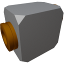

  

|Composant|`HighVoltageRelay`|
|---|---|
|**Module**|`ARCHEAN_junction`|
|**Masse**|1 kg|
|[**Taille**](# "Basée sur l'occupation du composant dans une grille fixe de 25 cm.")|25 x 25 x 25 cm|
#
---

# Description
Le HighVoltageRelay est un dispositif qui alimente un composant en ne laissant passer le courant que si une valeur de signal non nulle est envoyée à son port de données.

> La face avec deux ports est destinée à connecter la source d'alimentation et le port de données.
>
> La sortie d'énergie se trouve sur la face avec un seul port.
