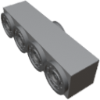

  

|Component|`FluidJunction`|
|---|---|
|**Module**|`ARCHEAN_junction`|
|**Mass**|20 kg|
|[**Size**](# "Based on the component's occupancy in a fixed 25cm grid.")|25 x 25 x 100 cm|
|**Push/Pull Fluid**|Accept Push/Pull -> Forwards action to other side|
#
---

# Description
La Fluid Junction est un composant qui permet la separation ou la combinaison de fluides.

# Usage
La Fluid Junction transfere les fluides selon la logique illustree dans l'image d'exemple ci-dessous. Les ports situes sur la face contenant 4 ports communiquent uniquement avec le port situe sur la face qui n'en contient qu'un seul.

Lorsque le fluide entre par le port unique du bas, il est distribue entre les quatre ports du haut en fonction de la capacite d'acceptation des composants connectes. Si tous les ports sont ouverts, le fluide est reparti uniformement. Cependant, si un ou plusieurs ports sont fermes (par exemple a cause d'une [fluid valve](./FluidValve.md)), la quantite totale de fluide est redistribuee uniquement entre les ports restants pouvant encore recevoir le flux.

  

