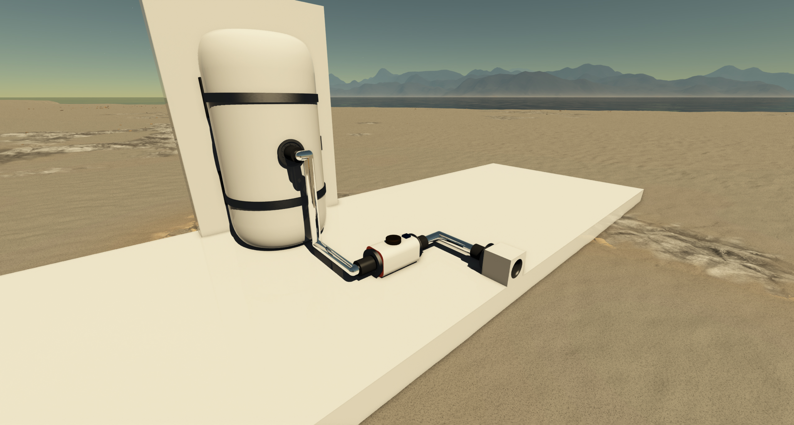

  

|Component|`FluidPort`|
|---|---|
|**Module**|`ARCHEAN_chemical`|
|**Mass**|1 kg|
|[**Size**](# "Based on the component's occupancy in a fixed 25cm grid.")|25 x 25 x 25 cm|
|**Push/Pull Fluid**|Accept Push/Pull|
#
---

# Description
Le Fluid Port est un dispositif qui permet l'aspiration ou l'ejection de fluides.

>  *Ce composant est lie a la pressurisation des constructions, veuillez consulter la page [Pressurization](../../pressurization.md) pour plus d'informations.*

Lorsqu'il aspire un fluide, il capte la composition de l'environnement environnant. Par exemple, s'il est immerge dans l'eau, il peut remplir un reservoir de fluide avec du H2O, et s'il est a l'air libre, il aspirera la composition de l'atmosphere.

Lorsqu'il expulse un fluide, il peut purger le contenu des reservoirs de fluide.

# Usage
Le Fluid Port sert de pont entre un conteneur de fluide et la composition de l'environnement environnant.

Pour fonctionner, il doit etre connecte a tout composant capable de contenir ou de traiter des fluides.

Voici un exemple illustrant comment il pourrait etre connecte.

## Limite de debit

Le Fluid Port a un debit maximum de **1.0 m³/s** (base sur le volume, pas sur la masse).

Comme la limite est volumetrique, la **masse reellement transferee depend de la densite du fluide** :
- Les fluides denses (liquides comme H2O, O2 liquide) transferent plus de masse par seconde
- Les fluides legers (gaz, atmosphere en haute altitude) transferent moins de masse par seconde
- Dans le vide (densite = 0), rien ne peut etre transfere

Par exemple :
- Eau (~1000 kg/m³) : jusqu'a 1000 kg/s
- Air au niveau de la mer (~1,2 kg/m³) : jusqu'a 1,2 kg/s
- Air en haute altitude (~0,4 kg/m³) : jusqu'a 0,4 kg/s

## Placement

Lors du placement d'un Fluid Port, assurez-vous que l'**ouverture de la buse est orientee vers** la zone avec laquelle vous souhaitez interagir. Vous pouvez le monter a fleur d'un mur avec l'ouverture orientee vers l'interieur - tant que la buse pointe vers le compartiment, il fonctionnera correctement.

## Fenetre d'information

Appuyez sur `V` sur un Fluid Port pour afficher :
- **Densite de l'environnement** (kg/m³) : La densite au point de mesure
- **Composition de l'environnement** : La composition du fluide en pourcentage volumique

Si le point de mesure se trouve a l'interieur d'un volume pressurise, il affichera le contenu du volume. Sinon, il affiche l'environnement ambiant (atmosphere, eau, etc.).