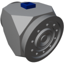

  

|Component|`FluidValve`|
|---|---|
|**Module**|`ARCHEAN_junction`|
|**Mass**|1 kg|
|[**Size**](# "Based on the component's occupancy in a fixed 25cm grid.")|25 x 25 x 25 cm|
|**Push/Pull Fluid**|accept Push/Pull -> forwards action to other side|
#
---

# Description
La Fluid Valve est un composant qui permet de controler le flux de fluide qui la traverse.

# Usage
Par defaut, la valve est fermee et bloque le passage du fluide. Pour controler le flux de fluide, envoyez un signal de donnees entre `0 (Ferme)` et `1 (Ouvert)`.

La valve transmet la temperature du fluide qui la traverse sur le canal 0.