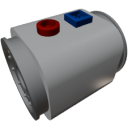

  

|Component|`FluidPump`|
|---|---|
|**Module**|`ARCHEAN_thruster`|
|**Mass**|10 kg|
|[**Size**](# "Based on the component's occupancy in a fixed 25cm grid.")|25 x 25 x 25 cm|
|**Push/Pull Fluid**|Initiate Push/Pull|
#
---

# Description
La Fluid Pump est un composant utilise pour transferer du fluide jusqu'a 1 kg par seconde. Contrairement aux turbo pumps, elle fonctionne en basse tension et reagit instantanement aux commandes de controle, permettant une gestion des fluides tres reactive.

# Usage
## Alimentation electrique
Pour utiliser la pompe, elle doit etre alimentee en basse tension. Elle consomme jusqu'a 1 kW a pleine vitesse.

## Donnees
Le port de donnees permet de controler la vitesse de la pompe en envoyant une valeur entre `-1` et `1`.
Lorsque la pompe est connectee a un ordinateur, il est egalement possible de recuperer le debit actuel.

> Lorsqu'une valeur negative est envoyee, la pompe fonctionne effectivement en sens inverse.
