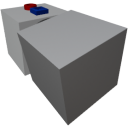
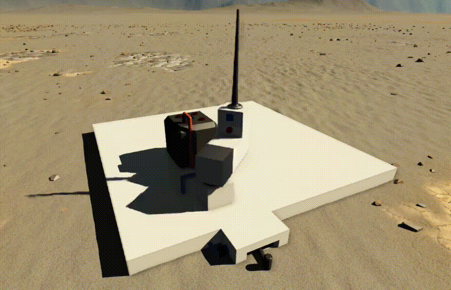

  

|Component|`SmallPivot`|
|---|---|
|**Module**|`ARCHEAN_build`|
|**Mass**|10 kg|
|[**Size**](# "Based on the component's occupancy in a fixed 25cm grid.")|25 x 25 x 50 cm|
#
---

# Description
Le Small Pivot est un composant qui inclut un bloc rotatif constructible. Il est concu pour permettre la rotation d'objets sur une construction.

>  *Ce composant est lie a la pressurisation des constructions, veuillez consulter la page [Pressurization](../../pressurization.md) pour plus d'informations.*

# Usage
Le Small Pivot peut fonctionner dans deux modes : Servo (par defaut) et Velocity. Pour basculer entre les modes, appuyez sur la touche V pour ouvrir l'interface d'information du composant.

Dans cette interface, deux configurations supplementaires sont possibles :
- `Max Rotation Speed` qui determine la vitesse de rotation maximale en rotations par seconde.
- `Acceleration` qui determine le taux (en rotations par seconde par seconde) auquel le pivot accelerera pour atteindre sa vitesse de rotation maximale.

## Servo Mode
En mode servo, le dispositif tourne vers une position precise determinee par les donnees recues via son port de donnees. Il accepte des valeurs normalisees entre `-1.0` et `+1.0`, qui correspondent a des rotations de `-360°` et `+360°`. Cela signifie effectivement que les valeurs `0.0`, `-1.0` et `+1.0` donneront la meme position servo.

## Velocity Mode
En mode velocity, le dispositif fonctionne en continu dans la direction indiquee par les donnees de son port, acceptant des valeurs entre `-1.0` et `+1.0` pour determiner sa vitesse et sa direction de rotation. `1.0` correspond a la vitesse de rotation maximale.

> - Les constructions installees sur une partie mobile ne peuvent pas entrer en collision avec une construction parente ou soeur. Elles ne peuvent entrer en collision qu'avec le terrain ou d'autres constructions separees.
> - Pour detruire le Small Pivot, vous devez absolument retirer tous les blocs/composants enfants qu'il contient.

### Liste des sorties
|Channel|Function|Value|
|---|---|---|
|0|Angle|-1.0 to +1.0|
|1|Speed|rot/s|

