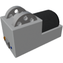

  

|Component|`Crusher`|
|---|---|
|**Module**|`ARCHEAN_machines`|
|**Mass**|400 kg|
|[**Size**](# "Based on the component's occupancy in a fixed 25cm grid.")|100 x 100 x 200 cm|
|**Push/Pull Item**|Accept Push, Initiate Push|
#
---

# Description
Le Crusher est un composant qui permet le broyage rapide de roches pour obtenir des minerais.

Il peut egalement etre utilise pour **recycler tout objet fabricable** en ses matieres premieres. Le processus de recyclage restitue **100% des ressources primaires** utilisees pour fabriquer l'objet, en decomposant recursivement la recette de fabrication.

> **Note :** Les [Batteries](../energy/battery/LowVoltageBattery.md) ont une recette de recyclage speciale qui ne restitue qu'environ **50%** de leur cout de fabrication. Cela empeche d'exploiter le systeme de recyclage pour obtenir des recharges gratuites en broyant et re-fabriquant des batteries epuisees.

# Usage
Le Crusher necessite une alimentation haute tension et consomme 10 kW.

Pour utiliser le Crusher, envoyez simplement des roches a broyer via son port d'entree d'objets. Il ne tire pas depuis son entree mais il est capable de pousser les minerais obtenus vers tout conteneur acceptant des objets.

Le Crusher est capable de traiter 400 kg de roches par seconde, correspondant a la production de 4 [Mining Drills](MiningDrill.md) fonctionnant a pleine puissance.

> Lorsque la composition des roches contient une faible concentration de certains minerais, le Crusher accumulera les minerais a faible concentration jusqu'a ce qu'il soit possible de produire au moins une unite du minerai.
