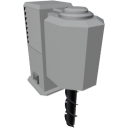

  

|Component|`MiningDrill`|
|---|---|
|**Module**|`ARCHEAN_celestial`|
|**Mass**|400 kg|
|[**Size**](# "Based on the component's occupancy in a fixed 25cm grid.")|200 x 200 x 100 cm|
|**Push/Pull Item**|Initiate Push|
#
---

# Description
Le Mining Drill est un composant qui permet de forer le terrain pour extraire des roches qui peuvent etre broyees pour obtenir des minerais.

# Usage
Pour fonctionner, il doit etre installe sur une construction qui doit etre ancree au sol a l'aide d'un [Ground Anchor](../miscellaneous/GroundAnchor.md).
Vous devez le connecter a un [Container](../storage/Container.md) ou tout autre composant acceptant des objets, pour collecter les roches extraites.

Selon le type d'energie, il peut extraire des roches a differentes vitesses.

|Energy|Power required|Speed|Depth|
|---|---|---|---|
|Low Voltage|10 kw|Jusqu'a 10 roches par seconde|0,01 metre par seconde|
|High Voltage|100kw|Jusqu'a 100 roches par seconde|0,1 metre par seconde|

## Recuperation des donnees
Le Mining Drill permet de recuperer a tout moment des informations sur la composition a sa position.
La valeur retournee est un objet [Key-Value](../../xenoncode/documentation.md#key-value-objects) presente dans le format suivant, par exemple : `.C{0.12}.Fe{0.05}.Si{0.03}.Cu{0.80}`.
Cela signifie que la position contient 12% de carbone, 5% de fer, 3% de silicium et 80% de cuivre.

## Efficacite et epuisement
La zone minee n'est pas illimitee, elle s'epuise progressivement en profondeur et l'efficacite diminue en consequence.
Vous devrez le relocaliser de temps en temps.

### Liste des sorties
|Channel|Function|
|---|---|
|0|Composition|
|1|Depth|
|2|Efficiency|
|3|MiningRate|
|4|DrillingRate|

