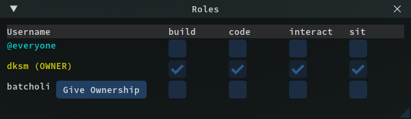

  

|Component|`OwnerPad`|
|---|---|
|**Module**|`ARCHEAN_ownership`|
|**Mass**|1 kg|
|[**Size**](# "Based on the component's occupancy in a fixed 25cm grid.")|25 x 50 x 50 cm|
#
---

# Description
L'OwnerPad est un dispositif de securite polyvalent qui assure la protection des constructions contre les actions malveillantes potentielles.

En plus de sa fonction de securite, il permet de sauvegarder l'etat d'une construction ou d'un vehicule (position, vitesse, niveau de batterie, interrupteurs...).
Avec cette fonctionnalite, il devient possible de revenir instantanement a cet etat en un seul clic.

# Usage
### Bouton SAVE & RESET
Le bouton `SAVE` sauvegarde la position d'une construction ainsi que l'etat de ses composants, tandis que le bouton `RESET` reinitialise la construction a l'etat dans lequel elle etait lors de la derniere sauvegarde.

### Bouton ROLES
Les roles permettent d'autoriser/interdire des actions sur une construction, comme illustre dans l'image d'exemple. Ils sont concus pour assurer la securite de vos constructions contre toute action malveillante d'autres joueurs.
Lorsque vous placez un OwnerPad sur une construction, si aucun autre OwnerPad n'est present, vous devenez le proprietaire de cette construction.

Par defaut, toutes les permissions sont definies sur `@Everyone`, rendant la construction completement publique.
En plus de `@Everyone` et `dksm (OWNER)` dans l'exemple, la liste de tous les joueurs connectes sera affichee, vous permettant d'attribuer des roles aux joueurs de votre choix.

Un bouton `Give Ownership` est present a cote de chaque joueur connecte pour transferer la propriete au joueur de votre choix. Vous n'aurez alors plus aucun droit sur la construction jusqu'a ce que le nouveau proprietaire vous accorde des roles.

### Controle via le port de donnees
L'OwnerPad dispose d'un port de donnees pour permettre le controle depuis un ordinateur ou a distance via un Beacon, par exemple.
Vous devez envoyer un texte dans le canal 0 contenant le mot-cle `"save"` ou `"reset"` selon l'action que vous souhaitez effectuer.

Vous devez envoyer un texte vide `""` pour reinitialiser l'etat avant de pouvoir envoyer une autre commande.
