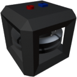

  

|Component|`SmallGyroscope`|
|---|---|
|**Module**|`ARCHEAN_gyroscope`|
|**Mass**|50 kg|
|[**Size**](# "Based on the component's occupancy in a fixed 25cm grid.")|50 x 50 x 50 cm|
#
---

# Description
Le gyroscope est un composant qui, lorsqu'il est alimente et actif, amortit sa vitesse angulaire. Il est principalement utilise pour stabiliser un vehicule ou arreter le moment angulaire en apesanteur.

# Alimentation electrique
Le SmallGyroscope est alimente en **basse tension**. Il consomme plus d'energie au demarrage puis reduit progressivement sa consommation a mesure qu'il atteint la vitesse de rotation demandee via le port de donnees.

# Usage
Pour demarrer le gyroscope, il doit recevoir une valeur entre `0.0` et `1.0` dans son port de donnees pour diminuer/augmenter sa vitesse de rotation, augmentant ainsi son effet stabilisant.

Le gyroscope permet d'orienter manuellement un vehicule via son port de donnees en exploitant le couple induit des roues inertielles a l'interieur. Il agira en fonction de son orientation et de sa vitesse de rotation.

### Liste des entrees
|Channel|Function|range|
|---|---|---|
|0|Speed| 0.0 to 1.0|
|1|Control| -1.0 to +1.0|

>Un gyroscope a un effet limite par rapport au poids de la construction. Vous pouvez augmenter le nombre de gyroscopes pour augmenter l'effet stabilisant.
