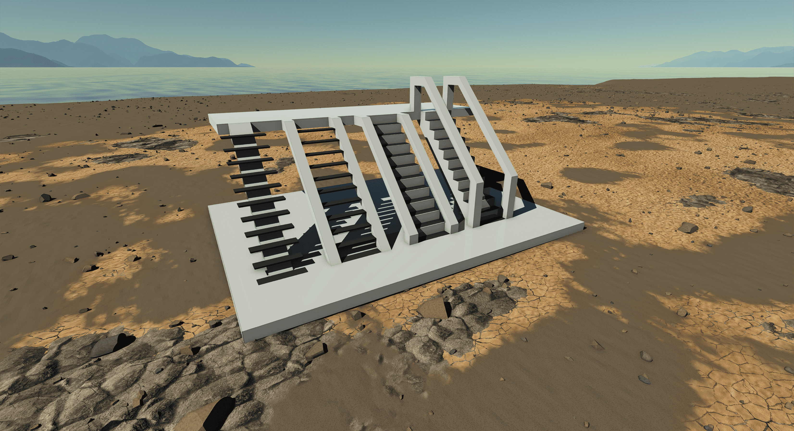

  

|Component|`Step`|
|---|---|
|**Module**|`ARCHEAN_misc`|
|**Mass**|1 kg|
|[**Size**](# "Based on the component's occupancy in a fixed 25cm grid.")|25 x 100 x 100 cm|
#
---

# Description
La marche d'escalier est un composant qui se presente sous forme de plaque, permettant la creation d'escaliers.

# Usage
La marche d'escalier peut etre placee sur des blocs et permet de monter ou descendre d'un bloc a un autre en utilisant son collider, qui a une forme triangulaire (voir la figure ci-dessous).

Ce systeme permet des escaliers entierement personnalisables.

