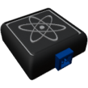

    

|Component|`VehiclePhysicsSensor`|
|---|---|
|**Module**|`ARCHEAN_sensor1`|
|**Mass**| 1 kg|
|[**Size**](# "Based on the component's occupancy in a fixed 25cm grid.")|25 x 25 x 25 cm|
#

---

# Description
Le Vehicle Physics Sensor est un composant qui fournit des informations sur l'etat physique du vehicule, sa masse, sa taille, son centre de masse et la force G.

# Usage
Une fois place sur votre construction, le capteur peut etre connecte a un ordinateur pour recuperer des informations sur la physique du vehicule. Voici les informations que vous pouvez recuperer :
- Active Physics : Indique si la physique est active ou non.
- Mass : La masse du vehicule.
- Size (X,Y,Z) : La taille englobante du vehicule.
- Center of Mass (X,Y,Z) : La position du centre de masse par rapport a la position du capteur.
- G-force (X,Y,Z) : La force G par rapport a l'orientation du capteur.

### Liste des sorties
|Channel|Function|Value|
|---|---|---|
|0|Active Physics|0 or 1|
|1|Mass|kg|
|2|Size X|meters|
|3|Size Y|meters|
|4|Size Z|meters|
|5|Center of Mass X|meters|
|6|Center of Mass Y|meters|
|7|Center of Mass Z|meters|
|8|G-force X|G|
|9|G-force Y|G|
|10|G-force Z|G|
