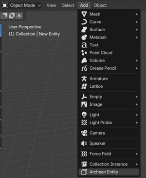

# Modélisation 3D avec Blender

## Installation du plugin

Voici deux méthodes pour installer le plugin dans Blender.

### Méthode 1 : Installation depuis un ZIP

1. Rendez-vous sur le dépôt du plugin [Archean Blender Plugin](https://github.com/batcholi/archean_blender_plugin)
2. Cliquez sur le bouton vert "Code" et choisissez "Download ZIP"
3. Ouvrez Blender
4. Dans Blender, allez dans Edit > Preferences > Add-ons
5. Choisissez "Install from Disk", puis sélectionnez le fichier ZIP téléchargé

   
6. Une fois l'installation terminée, activez le plugin dans la liste des add-ons.

### Méthode 2 : Installation par clonage du dépôt
1. Ouvrez un terminal sur votre système.
2. Clonez le dépôt du plugin dans le dossier add-ons de Blender en exécutant :
   ```bash
   git clone https://github.com/batcholi/archean_blender_plugin <addons_path>
   ```
3. Lancez Blender et vérifiez que le plugin apparaît dans la liste des add-ons.
4. Activez le plugin si nécessaire.

<font color="orange">Pour les utilisateurs Windows :</font> Installez **Git** et utilisez `Git Bash` pour cloner le dépôt. Dans l'invite de commandes (CMD), Git ne sera pas reconnu si le chemin de l'exécutable n'a pas été ajouté à la variable d'environnement.

---

## Aperçu du plugin

Le plugin ajoute deux nouveaux éléments à Blender :
1. Dans le menu "Add" en mode Object, un nouveau type d'objet **Archean Entity**, qui ajoute une structure de base pour créer un nouveau composant.

	

2. Dans le viewport, un menu **Archean** apparaît avec divers paramètres.

	

## Utilisation du plugin

Une entité Archean est toujours constituée d'une structure spécifique. Voici ses éléments :

*Les éléments marqués en <font color="green">vert</font> sont requis, ceux en <font color="orange">orange</font> sont optionnels.*
- **<font color="green">Entity Root</font>** : L'objet racine de l'entité. Il est essentiel pour l'export et doit toujours être présent.
- **<font color="green">Renderable</font>** : Un objet enfant de l'Entity Root. C'est l'objet visible en jeu. Vous pouvez en avoir plusieurs, mais nous recommandons d'optimiser pour en garder le moins possible.
- **<font color="orange">Collider</font>** : Un enfant de l'Entity Root qui définit la zone de collision. Un collider peut contenir 6 à 8 sommets. Vous pouvez placer plusieurs colliders dans une entité, mais nous encourageons à limiter ce nombre pour des raisons de performance.
- **<font color="orange">Adapter</font>** : Un enfant de l'Entity Root, généralement combiné avec un **Single Arrow**, qui définit les points de connexion utilisés pour les câbles de données, d'alimentation, de fluides ou d'objets.
- **<font color="orange">Joint</font>** : Un objet enfant de l'Entity Root qui, généralement combiné avec un **Single Arrow**, définit les points d'articulation pour animer des parties de l'entité par translation ou rotation. Un joint devient le parent de tout objet inclus à l'intérieur, y compris d'autres joints.
- **<font color="orange">Target</font>** : Un objet enfant de l'Entity Root qui, souvent combiné avec un **Single Arrow**, définit une position et une direction pouvant être utilisées pour ajouter des fonctionnalités avec XenonCode.

### Aperçu des paramètres
Selon que vous avez sélectionné l'Entity Root ou l'un de ses enfants, la liste des paramètres disponibles change.
#### Boutons du menu Entity Root
- **Export this Entity and Save** : Exporte l'entité dans le dossier où le fichier .blend est sauvegardé, puis sauvegarde le fichier.
- **Generate Thumbnail** : Génère une miniature de l'entité, utilisée comme icône dans le jeu.
#### Paramètres de l'Entity Root
- **Is Entity Root** : Cochez cette case pour marquer l'objet comme Entity Root. Cela déverrouille les fonctionnalités spécifiques aux entités.
- **Mass (kg)** : La masse de l'entité en kilogrammes.
- **Airtight** : Définit si l'entité sera étanche à l'air dans le système de construction d'Archean. N'oubliez pas que le volume considéré est celui du collider, pas celui du renderable. Si aucun collider n'est présent lors de l'export, le jeu en crée automatiquement un englobant l'entité.
- **Base Plane is Minus Y** : Par défaut, le plan de base de l'entité s'aligne sur l'axe -Z. Cochez cette case pour l'aligner sur l'axe -Y à la place.
- **Export Vertex UVs** : Cochez cette option pour exporter les coordonnées UV. C'est particulièrement important lors de l'utilisation d'écrans, de textures...

#### Bouton du menu des objets enfants
- **Create Default Materials** : Archean utilise une palette spécifique pour les entités, les ports, etc. Cliquez sur ce bouton pour générer automatiquement les matériaux par défaut.
#### Paramètres des objets enfants
- **Is Renderable** : Indique que cet objet sera rendu en jeu. Un sous-paramètre **Export Sharp Edges** apparaît, vous permettant d'exporter les arêtes marquées comme "Sharp" dans Blender afin qu'elles apparaissent en fil de fer dans les hologrammes du jeu.
- **Is Joint** : Marque l'objet comme un joint. Une liste de sous-paramètres apparaît pour activer les contraintes de rotation et de translation.
- **Is Target** : Marque l'objet comme une cible utilisable pour des fonctionnalités. Sa position et sa direction sont importantes selon l'utilisation.
- **Is Collider** : Marque l'objet comme un collider. Les colliders doivent être simples et contenir entre 6 et 8 sommets. Un sous-paramètre **Is Build Block** apparaît pour que le collider puisse aussi servir de bloc de construction, permettant aux entités ou blocs de s'accrocher dessus tout en restant alignés avec la grille d'Archean.
- **Is Adapter** : Marque l'objet comme un point de connexion pour les câbles de données, d'alimentation, de fluides ou d'objets. Un sous-paramètre en liste déroulante et un bouton **Create Mesh** vous permettent de générer directement le mesh du connecteur.

> L'équipe de développement d'Archean utilise généralement des objets **Single Arrow** pour les adapters, les joints et les targets car ce sont simplement une position et une direction.

---

## Créer votre première entité

La première étape importante est de bien s'orienter dans l'espace 3D. Dans Archean, l'axe Y correspond à avant/arrière, l'axe X à gauche/droite, et l'axe Z à haut/bas.


1. Ouvrez Blender et créez une nouvelle scène.
2. Supprimez tout ce qui se trouve actuellement dans la scène (par défaut un cube, une caméra et une lumière).
3. Dans le menu "Add" en mode Object, ajoutez une nouvelle **Archean Entity**.

   Cet objet initial contient un **Entity Root** et un simple cube marqué comme **Renderable**. Le nom de l'Entity Root est le nom de l'entité utilisé pour l'export et en jeu.

   > Le nom de l'**Entity Root** ne doit pas contenir d'espaces ni de caractères spéciaux — uniquement des caractères alphanumériques.
4. Mettez le cube à l'échelle `0.5 x 0.5 x 0.5`, soit `50 x 50 x 50 cm`, car le cube par défaut est trop grand. *(Cela fait 2 x 2 x 2 mètres en jeu.)*
5. Sauvegardez le projet dans un dossier avant d'aller plus loin afin de pouvoir exporter l'entité plus tard.
   > - Sauvegardez le projet dans le dossier de votre composant : `Archean/Archean-data/mods/MYVENDOR_mymod/components/MyComponentName/`
   > - Consultez [Pour commencer](getting-started.md) pour savoir comment créer un mod et configurer cette structure de dossiers.
   > - <font color="orange"> Un mod peut contenir plusieurs composants, chacun dans son propre dossier.</font>
   > - <font color="red">/!\ Le nom du dossier du composant doit correspondre au nom de l'Entity Root.</font>

### Ajouter le port de données
Ajoutez un objet **Single Arrow** sur une face du cube pour créer un port de données. Générez son mesh, assignez le bon matériau, et joignez-le à l'objet principal pour éviter de créer un renderable séparé. Comme les ports utilisent souvent un lissage (smooth shading), appliquez un modificateur "Edge Split" à l'objet principal pour éviter les artefacts visuels.

<video src="./blender-res/dataport.mp4" width="700" height="438" controls loop muted></video>

### Ajouter un joint pour faire tourner Suzanne
Ajoutez un objet **Single Arrow** au-dessus du cube pour définir un point d'articulation. Marquez-le comme **Is Joint** et activez la rotation autour de l'axe Z uniquement. Puis parentez les objets enfants du joint — Suzanne (la tête de singe de Blender) et un cylindre pour la base.

Puisque Suzanne peut effectuer une rotation complète, définissez **-360** comme valeur **Low**, **0** comme **Neutral** (position par défaut), et **360** comme **High**.

<video src="./blender-res/joint.mp4" width="700" height="438" controls loop muted></video>

### Ajouter un écran
Pour l'exemple, créez un objet qui servira de base pour l'écran. Assignez d'abord un matériau ressemblant à un afficheur, puis dépliez les UV en sélectionnant la face de l'écran de sorte qu'elle remplisse entièrement l'éditeur UV.

> Assurez-vous d'activer **Export Vertex UVs** sur l'Entity Root pour que les coordonnées UV soient exportées.
> L'apparence du matériau de l'écran est à votre choix ; par exemple, vous pouvez transformer une surface en verre en écran.

<video src="./blender-res/screen.mp4" width="700" height="438" controls loop muted></video>

### Ajouter un collider
Pour finir, ajoutez un collider qui définit la zone de collision de l'entité. Ajoutez un cube, mettez-le à l'échelle pour englober toute l'entité, et positionnez-le correctement. Marquez-le comme **Is Collider** et masquez-le dans le viewport.

<video src="./blender-res/collider.mp4" width="700" height="438" controls loop muted></video>

### Gestion des ports pour XenonCode
Le nommage des ports suit une convention spécifique pour les rendre facilement identifiables dans XenonCode. Voici comment cela fonctionne :
- Les ports de données doivent être nommés **data** selon le format `data.index`, ou simplement `data` s'il n'y en a qu'un seul. Ce nommage est requis pour pouvoir y accéder via `input.index` et `output.index` dans XenonCode.
  Exemple avec deux ports de données : Nommez-les `data.0` et `data.1`. Dans XenonCode, vous y accéderiez via `input.0` et `input.1`.
  Exemple avec un seul port de données : Nommez-le simplement `data`. Dans XenonCode, vous y accéderiez via `input.0` et `output.0`.

- Tous les autres types de ports (Power, Fluid, Item, etc.) n'ont pas d'exigence de nommage spécifique. Leur nom déclaré est utilisé directement dans XenonCode.

### Générer la miniature et exporter
Une fois que tout est configuré, générez la miniature et exportez l'entité.
- Renommez correctement l'Entity Root.
- Assurez-vous que Suzanne est marquée comme Renderable.

<video src="./blender-res/suzanne.mp4" width="700" height="438" controls loop muted></video>

## Questions fréquentes
### Pourquoi je vois parfois un message "Fix now" dans le menu du plugin ?
Les objets doivent avoir leur échelle appliquée pour éviter les problèmes d'export. Le bouton "Fix now" applique l'échelle à tous les objets de la scène en une fois. Généralement, vous pouvez éviter ce message en appliquant l'échelle d'un objet avec **Ctrl + A** et en choisissant **Apply > Scale**.

### L'orientation de la miniature ne me convient pas. Comment la changer ?
Faites pivoter l'Entity Root pour changer le cadrage de la miniature. Nous recommandons de ne jamais appliquer cette rotation afin de pouvoir facilement remettre l'entité dans son orientation d'origine. Vous n'avez besoin de régénérer la miniature que lorsque l'aspect visuel change.

### Pourquoi faut-il éviter de créer trop de Renderables ?
Le moteur de rendu d'Archean est 100% ray tracing, donc le nombre de sommets importe peu. Le nombre d'objets, en revanche, a un impact direct sur les performances. Gardez à l'esprit que `Nombre de Renderables = renderables par entité * nombre d'entités` dans un rayon d'environ 100 km, selon la taille finale de l'entité. *(Plus l'entité est grande, plus le rayon de rendu est important.)*

### Vaut-il mieux afficher du texte comme texture ou comme mesh ?
Grâce au ray tracing, le texte en mesh est souvent plus performant et a un meilleur rendu car il offre une qualité visuelle supérieure et consomme peu de VRAM comparé aux textures.

### J'ai l'habitude de faire des assets low-poly pour les jeux. Dois-je faire pareil pour Archean ?
Pas du tout — vous pouvez créer des modèles très détaillés. Le ray tracing offre une qualité visuelle extrêmement élevée. Fait amusant : Blender plantera probablement avant Archean. Amusez-vous avec ces sommets !

### Quelles couleurs utilisent les composants officiels ?
Lorsque vous générez les matériaux avec **Create Default Materials**, **Color1** est le blanc utilisé sur la plupart des composants, **Color2** est le gris métallique, et **Body** est le noir. Les autres matériaux ont des noms explicites.
