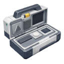

  

|Item|`DashboardTool`|
|---|---|
|**Module**|`ARCHEAN_build`|

# Description
Le Dashboard Tool est utilisé pour concevoir des tableaux de bord avec des composants plus petits de manière plus flexible. Il vous permet de placer des écrans, des boutons, des LEDs, des labels et d'autres éléments sur des surfaces pour créer des panneaux de contrôle et des affichages personnalisés.

# Usage
Appuyez sur `C` pour ouvrir le menu radial et sélectionner l'élément que vous souhaitez placer.

Appuyez sur `V` pour ouvrir le menu GetInfo d'un élément et accéder aux options supplémentaires.

## Éléments disponibles

### Écrans

| Type | Résolution | Taille max |
|------|------------|----------|
| Standard Screen | 2 pixels/cm (200 px/m) | 4 m |
| HD Screen | 6 pixels/cm (600 px/m) | 50 cm |

Les HD Screens offrent une densité de pixels 3 fois supérieure pour des affichages plus détaillés mais sont limités à 50 cm.

Les écrans se mettent à jour toutes les 20 ms.

**Options GetInfo (`V`) :**
- **Matte** : Basculer entre une surface brillante et mate

### Labels
Les Labels fonctionnent comme des écrans mais avec une résolution de 5 pixels/cm (500 px/m) et une taille maximale de 1 m.

Les Labels se mettent à jour toutes les 500 ms, ce qui les rend plus adaptés aux affichages de texte statiques ou à changement lent.

**Options GetInfo (`V`) :**
- **Text** : Saisir le texte à afficher (multiligne supporté)
- **Text Align** : Center, Left, Right, Top, Bottom, Top Left, Bottom Left, Top Right, Bottom Right
- **Text Size** : 1 à 8
- **Color picker** : Définir la couleur du texte

### Boutons

#### [PushButton](../components/controllers/PushButton.md)
Envoie un signal lorsqu'il est appuyé.

**Options GetInfo (`V`) :**
- **Single Pulse** : Lorsqu'activé, envoie une seule impulsion par pression au lieu d'un signal continu tant que le bouton est maintenu

#### [ToggleButton](../components/controllers/ToggleButton.md)
Bascule entre les états activé/désactivé lorsqu'il est cliqué.

**Options GetInfo (`V`) :**
- **Allow IO input** : Accepter les signaux d'entrée pour contrôler l'état
- **Horizontal** : Basculer l'orientation horizontale

#### ArrowButton
Bouton directionnel avec options de rotation.

**Options GetInfo (`V`) :**
- **Rotation** : 0-3 (incréments de 90°)
- **Single Pulse** : Identique au PushButton

### LED
Les LEDs peuvent être cliquées comme des boutons poussoirs et peuvent afficher des couleurs personnalisées.

**Options GetInfo (`V`) :**
- **Single Pulse (press)** : Envoyer une seule impulsion par clic
- **Color From Input** : Recevoir la valeur de couleur depuis le canal de données au lieu d'utiliser la couleur configurée
- **Color picker** : Définir la couleur de la LED

### Trim
Le Trim est un élément décoratif qui peut être placé avec une précision de 1 cm et redimensionné par incréments de 1 cm jusqu'à 4 m. Utile pour ajouter une séparation visuelle ou des bordures à la disposition de votre tableau de bord.

## Ajouter des composants aux tableaux de bord
N'importe quel composant peut être placé sur un tableau de bord à des positions et orientations arbitraires. Cela permet d'intégrer des instruments, des capteurs ou d'autres composants directement dans la conception de votre tableau de bord.

## Programmation
Pour des informations sur la programmation des écrans de tableau de bord avec XenonCode, consultez la [documentation XenonCode des Dashboard](../xenoncode/dashboard.md).
