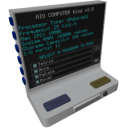
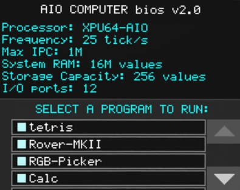

  

|Component|`Computer`|
|---|---|
|**Module**|`ARCHEAN_computer`|
|**Mass**|10 kg|
|[**Size**](# "Based on the component's occupancy in a fixed 25cm grid.")|100 x 100 x 50 cm|
#
---
> Per imparare ad utilizzare l'interfaccia di programmazione del computer, visita la pagina XenonCode IDE.

# Description

Il computer è un componente progettato per eseguire programmi XenonCode per controllare altri componenti o visualizzare varie informazioni sul suo schermo.

Possiede caratteristiche che determinano la sua potenza, capacità di archiviazione e memoria.
Queste informazioni sono visibili nel BIOS come mostrato nell'immagine seguente.

### Informazioni del BIOS:
- **Processor Type**: Il processore XPU64-AIO fa riferimento a questo tipo di componente computer All-In-One.
- **Frequency**: La frequenza è la velocità alla quale il computer esegue il codice del programma corrente e corrisponderà all'impostazione `updates_per_second` del server (25 tick al secondo per impostazione predefinita).
- **Max IPC**: Questo parametro è determinato da un file di configurazione ed è il numero massimo di istruzioni per ciclo prima che il computer "crashi" virtualmente.
- **System RAM**: Nei programmi XenonCode, è possibile memorizzare valori in variabili volatili che si azzerano quando il computer si riavvia o quando un programma viene ricaricato. Questo parametro rappresenta il numero massimo di valori per tutte le variabili del programma attualmente in esecuzione.
- **Storage Capacity**: Simile alla RAM di sistema, esiste un tipo di variabile di archiviazione che memorizza i dati sul disco rigido in modo permanente fino alla modifica. In questo caso, è limitato a un massimo di 256 valori.
- **I/O Ports**: Questo parametro è determinato dai componenti e indica semplicemente il numero di porte dati sul computer.

> Il BIOS è un programma che viene eseguito per impostazione predefinita su ogni computer all'avvio.
>
> In questo caso, il suo ruolo è indicare le caratteristiche del computer così come l'elenco dei programmi disponibili sul disco rigido, in modo da poterne selezionare uno da eseguire.
>
> È possibile personalizzare il BIOS creando un nuovo file chiamato "main.xc" per modificarne l'aspetto o caricare automaticamente un programma. Per maggiori informazioni, consultare la documentazione di XenonCode IDE.

# Usage
### Programma:
Quando un programma viene creato e salvato, apparirà nell'elenco dei programmi sul BIOS. È possibile selezionare il programma da eseguire utilizzando il tasto `F`.
### Pulsanti:
Il computer ha due pulsanti fisici, il pulsante "Code" che apre il XenonCode IDE per lo sviluppo dei programmi, e un pulsante "Reboot" che riavvia il computer e riesegue il programma main.xc (BIOS).
### Alimentazione:
Per funzionare, il computer richiede un'alimentazione a bassa tensione. Consuma 30 watt in stato di inattività e il suo consumo può salire fino a 500 watt a seconda del rapporto tra il numero di istruzioni eseguite dal programma attualmente in esecuzione e il MAX IPC corrente configurato sul server.
### HDD:
Il Computer dispone di un alloggiamento per disco rigido. È possibile avere più HDD nell'alloggiamento (solo uno attivo alla volta), scambiare HDD con altri computer o conservarli nel proprio inventario. Questo è utile quando si desidera spostare il computer altrove senza perdere il proprio codice.

---
>- La risoluzione dello schermo integrato è di 200x160 pixel.
>- *Il contenuto degli HDD (il vostro codice) non viene perso se distruggete un componente Computer per errore. Continuerà ad esistere nei file del server (o nel vostro computer se giocate in modalità solo). Potete trovarlo in (Server Settings)/worlds/(World Name)/ARCHEAN_computer/HDD-... Potete anche modificare il codice da lì e il computer si riavvierà in tempo reale nel gioco, se preferite usare un editor esterno (VSCode ha effettivamente un'estensione XenonCode disponibile)*
