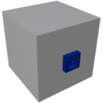

  

|Component|`DataBridge`|
|---|---|
|**Module**|`ARCHEAN_junction`|
|**Mass**|1 kg|
|[**Size**](# "Based on the component's occupancy in a fixed 25cm grid.")|25 x 25 x 25 cm|
#
---

# Description
Il Data Bridge è un componente che consente semplicemente di riposizionare un punto terminale dati in un'altra posizione.

> Il Data Bridge riposiziona letteralmente il punto terminale dati sul Data Bridge stesso.
>
> Per fare riferimento a tali dati, il Data Bridge deve essere referenziato tramite alias anziché il componente da cui si sta tentando di leggere.
