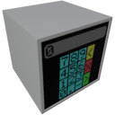

    

|Component|`Numpad`|
|---|---|
|**Module**|`ARCHEAN_hid`|
|**Mass**|1 kg|
|[**Size**](# "Based on the component's occupancy in a fixed 25cm grid.")|25 x 25 x 25 cm|
#
---
# Description
Il Numpad è un componente che fornisce un tastierino numerico tattile per inviare valori numerici ad altri componenti.

# Usage
È possibile inserire un valore numerico utilizzando i pulsanti tattili del tastierino numerico premendo il tasto `F`, e verranno visualizzati sullo schermo del Numpad ma diventeranno effettivi/aggiornati solo quando il pulsante di conferma (verde) viene premuto.

Il pulsante giallo consente di cancellare l'ultima cifra inserita, mentre il pulsante rosso consente di cancellare tutto.

> - Se il valore corrente è negativo, è possibile renderlo positivo premendo il pulsante tattile `-`.
> - Quando il pulsante di conferma viene premuto, un `1` viene inviato sul canale 1 per 1 tick, altrimenti viene inviato `0`.
