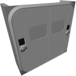

  

|Component|`DockableDoor`|
|---|---|
|**Module**|`ARCHEAN_build`|
|**Mass**|400 kg|
|[**Size**](# "Based on the component's occupancy in a fixed 25cm grid.")|250 x 250 x 100 cm|
|**Push/Pull Fluid**|Accept Push/Pull -> Forwards action to other side|
#
---

# Description
La Dockable Door è una grande porta che può agganciarsi a una porta simile per collegare due costruzioni insieme. L'aggancio consente il trasferimento di dati, energia e fluidi tra le costruzioni collegate, ma vincola anche le due costruzioni insieme in termini di fisica. Sono bloccate insieme.

> - Le Dockable Door possono essere installate solo sulla faccia dei frame.
> - La Dockable Door può essere agganciata solo a un'altra Dockable Door.
> -  *Questo componente è legato alla pressurizzazione delle costruzioni, consultare la pagina [Pressurization](../../pressurization.md) per maggiori informazioni.*

# Usage
Per funzionare correttamente, la Dockable Door deve essere alimentata tramite bassa tensione. Consuma 20 watt quando è inattiva e fino a 250 watt quando le porte sono in movimento.

Il lato interno della porta ha due pannelli per interagire con la porta o trasferire dati, energia o fluidi attraverso la porta di aggancio.

Ecco un'immagine che illustra i due pannelli.
- Il pannello in verde serve per interagire con la porta, alimentarla e controllarla da remoto tramite una porta dati. (La tabella sotto indica gli input/output della porta dati)
- Il pannello in blu serve per collegare vari cavi che trasferiranno dati, energia o fluidi da/verso l'altra porta agganciata.

### Usage with aliases
L'utilizzo degli alias predefiniti non è possibile per entrambe le porte contemporaneamente perché l'oggetto mostrerà un solo campo alias nella sua finestra informativa (`V`). Allo stesso modo, il [router](../computers/Router.md) mostra un solo campo alias per componente.
Per utilizzare separatamente le porte dati con gli alias, è necessario usare un [data bridge](../computers/DataBridge.md) o una [data junction](../computers/DataJunction.md). Questo consente di assegnare gli alias a questi oggetti invece che alle porte di aggancio.

### List of inputs
|Channel|Function|
|---|---|
|0|Close/Open Door|
|1|Arm/Disarm Dock|

### List of outputs
|Channel|Function|
|---|---|
|0|Door State|
|1|Dock State|
